# Gene coexpression network inference

## Introduction

To date, several packages have been developed to infer gene coexpression
networks from expression data, such as WGCNA (Langfelder and Horvath
2008), CEMiTool (Russo et al. 2018) and petal (Petereit et al. 2016).
However, network inference and analysis is a non-trivial task that
requires solid statistical background, especially for data preprocessing
and proper interpretation of results. Because of that, inexperienced
researchers often struggle to choose the most suitable algorithms for
their projects. Besides, different packages are required for each step
of a standard network analysis, and their distinct syntaxes can hinder
interoperability between packages, particularly for non-advanced R
users. Here, we have developed an all-in-one R package that uses
state-of-the-art algorithms to facilitate the workflow of biological
network analysis, from data acquisition to analysis and interpretation.
This will likely accelerate network analysis pipelines and advance
systems biology research.

## Installation

`if``(``!`[`requireNamespace`](https://rdrr.io/r/base/ns-load.html)`(``'BiocManager'``, quietly ``=`` ``TRUE``)``)`` `` `[`install.packages`](https://rdrr.io/r/utils/install.packages.html)`(``'BiocManager'``)`` `` ``BiocManager``::`[`install`](https://bioconductor.github.io/BiocManager/reference/install.html)`(``"BioNERO"``)`

`# Load package after installation`` `[`library`](https://rdrr.io/r/base/library.html)`(`[`BioNERO`](https://github.com/almeidasilvaf/BioNERO)`)`` `[`set.seed`](https://rdrr.io/r/base/Random.html)`(``123``)`` ``# for reproducibility`

## Data loading and preprocessing

For this tutorial, we will use maize (*Zea mays*) gene expression data
normalized in TPM. The data were obtained from Shin et al. (2020) and
were filtered for package size issues. For more information on the data
set, see [`?zma.se`](../reference/zma.se.md). The data set is stored as
a SummarizedExperiment object.[^1]

The input expression data in `BioNERO` can be both a
SummarizedExperiment object or a gene expression matrix or data frame
with genes in rows and samples in columns. However, we strongly
recommend using SummarizedExperiment objects for easier interoperability
with other Bioconductor packages.

[`data`](https://rdrr.io/r/utils/data.html)`(``zma.se``)`` `` ``# Take a quick look at the data`` ``zma.se`` ``## class: SummarizedExperiment `` ``## dim: 10802 28 `` ``## metadata(0):`` ``## assays(1): ''`` ``## rownames(10802): ZeamMp030 ZeamMp044 ... Zm00001d054106 Zm00001d054107`` ``## rowData names(0):`` ``## colnames(28): SRX339756 SRX339757 ... SRX2792103 SRX2792104`` ``## colData names(1): Tissue`` ``SummarizedExperiment``::`[`colData`](https://rdrr.io/pkg/SummarizedExperiment/man/SummarizedExperiment-class.html)`(``zma.se``)`` ``## DataFrame with 28 rows and 1 column`` ``## Tissue`` ``## <character>`` ``## SRX339756 endosperm`` ``## SRX339757 endosperm`` ``## SRX339758 endosperm`` ``## SRX339762 endosperm`` ``## SRX339763 endosperm`` ``## ... ...`` ``## SRX2792107 whole_seedling`` ``## SRX2792108 whole_seedling`` ``## SRX2792102 whole_seedling`` ``## SRX2792103 whole_seedling`` ``## SRX2792104 whole_seedling`

### Step-by-step data preprocessing

This section is suitable for users who want to have more control of
their data analysis, as they can inspect the data set after each
preprocessing step and analyze how different options to the arguments
would affect the expression data. If you want a quick start, you can
skip to the next section (*Automatic, one-step data preprocessing*).

**Step 1:** Replacing missing values. By default,
[`replace_na()`](../reference/replace_na.md) will replace NAs with 0.
Users can also replace NAs with the mean of each row (generally not
advisable, but it can be useful in very specific cases).

`exp_filt`` ``<-`` `[`replace_na`](../reference/replace_na.md)`(``zma.se``)`` `[`sum`](https://rdrr.io/r/base/sum.html)`(`[`is.na`](https://rdrr.io/r/base/NA.html)`(``zma.se``)``)`` ``## [1] 0`

**Step 2:** Removing non-expressed genes. Here, for faster network
reconstruction, we will remove every gene whose median value is below
10. The function’s default for `min_exp` is 1. For other options, see
[`?remove_nonexp`](../reference/remove_nonexp.md).

`exp_filt`` ``<-`` `[`remove_nonexp`](../reference/remove_nonexp.md)`(``exp_filt``, method ``=`` ``"median"``, min_exp ``=`` ``10``)`` `[`dim`](https://rdrr.io/r/base/dim.html)`(``exp_filt``)`` ``## [1] 8529 28`

**Step 3 (optional):** Filtering genes by variance. It is reasonable to
remove genes whose expression values do not vary much across samples,
since we often want to find genes that are more or less expressed in
particular conditions. Here, we will keep only the top 2000 most
variable genes. Users can also filter by percentile (e.g., the top 10%
most variable genes).

`exp_filt`` ``<-`` `[`filter_by_variance`](../reference/filter_by_variance.md)`(``exp_filt``, n ``=`` ``2000``)`` `[`dim`](https://rdrr.io/r/base/dim.html)`(``exp_filt``)`` ``## [1] 2000 28`

**Step 4:** Removing outlying samples. There are several methods to
remove outliers. We have implemented the Z.K (standardized connectivity)
method (Oldham et al. 2012) in
[`ZKfiltering()`](../reference/ZKfiltering.md), which is a network-based
approach to remove outliers. This method has proven to be more suitable
for network analysis, since it can remove outliers that other methods
(such as hierarchical clustering) cannot identify. By default, BioNERO
considers all samples with ZK \< 2 as outliers, but this parameter is
flexible if users want to change it.

`exp_filt`` ``<-`` `[`ZKfiltering`](../reference/ZKfiltering.md)`(``exp_filt``, cor_method ``=`` ``"pearson"``)`` ``## Number of removed samples: 1`` `[`dim`](https://rdrr.io/r/base/dim.html)`(``exp_filt``)`` ``## [1] 2000 27`

**Step 5:** Adjusting for confounding artifacts. This is an important
step to avoid spurious correlations resulting from confounders. The
method was described by Parsana et al. (2019), who developed a principal
component (PC)-based correction for confounders. After correction, the
expression data are quantile normalized, so every gene follows an
approximate normal distribution.

`exp_filt`` ``<-`` `[`PC_correction`](../reference/PC_correction.md)`(``exp_filt``)`

### Automatic, one-step data preprocessing

Alternatively, users can preprocess their data with a single function.
The function [`exp_preprocess()`](../reference/exp_preprocess.md) is a
wrapper for the functions [`replace_na()`](../reference/replace_na.md),
[`remove_nonexp()`](../reference/remove_nonexp.md),
[`filter_by_variance()`](../reference/filter_by_variance.md),
[`ZKfiltering()`](../reference/ZKfiltering.md) and
[`PC_correction()`](../reference/PC_correction.md). The arguments passed
to [`exp_preprocess()`](../reference/exp_preprocess.md) will be used by
each of these functions to generate a filtered expression data frame in
a single step.[^2]

`final_exp`` ``<-`` `[`exp_preprocess`](../reference/exp_preprocess.md)`(`` `` ``zma.se``, min_exp ``=`` ``10``, variance_filter ``=`` ``TRUE``, n ``=`` ``2000`` ``)`` ``## Number of removed samples: 1`` `[`identical`](https://rdrr.io/r/base/identical.html)`(`[`dim`](https://rdrr.io/r/base/dim.html)`(``exp_filt``)``, `[`dim`](https://rdrr.io/r/base/dim.html)`(``final_exp``)``)`` ``## [1] TRUE`` `` ``# Take a look at the final data`` ``final_exp`` ``## class: SummarizedExperiment `` ``## dim: 2000 27 `` ``## metadata(0):`` ``## assays(1): ''`` ``## rownames(2000): ZeamMp030 ZeamMp092 ... Zm00001d054093 Zm00001d054107`` ``## rowData names(0):`` ``## colnames(27): SRX339756 SRX339757 ... SRX2792103 SRX2792104`` ``## colData names(1): Tissue`

## Exploratory data analysis

`BioNERO` includes some functions for easy data exploration. These
functions were created to avoid having to type code chunks that,
although small, will be used many times. The idea here is to make the
user experience with biological network analysis as easy and simple as
possible.

**Plotting heatmaps:** the function
[`plot_heatmap()`](../reference/plot_heatmap.md) plots heatmaps of
correlations between samples or gene expression in a single line.
Besides the arguments users can pass to parameters in
[`plot_heatmap()`](../reference/plot_heatmap.md), they can also pass
additional arguments to parameters in
[`ComplexHeatmap::pheatmap()`](https://rdrr.io/pkg/ComplexHeatmap/man/pheatmap.html)
to have additional control additional on plot aesthetics (e.g.,
hide/show gene and sample names, activate/deactivate clustering for rows
and/or columns, etc).

`# Heatmap of sample correlations`` ``p`` ``<-`` `[`plot_heatmap`](../reference/plot_heatmap.md)`(``final_exp``, type ``=`` ``"samplecor"``, show_rownames ``=`` ``FALSE``)`` ``p`

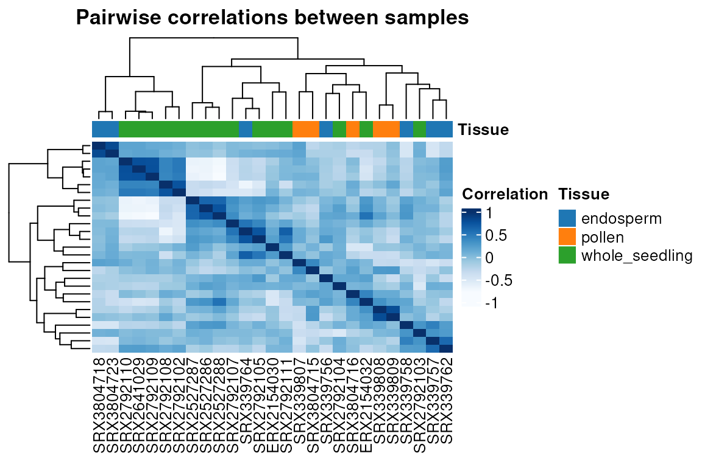

` ``# Heatmap of gene expression (here, only the first 50 genes)`` ``p`` ``<-`` `[`plot_heatmap`](../reference/plot_heatmap.md)`(`` `` ``final_exp``[``1``:``50``, ``]``, type ``=`` ``"expr"``, show_rownames ``=`` ``FALSE``, show_colnames ``=`` ``FALSE`` ``)`` ``p`

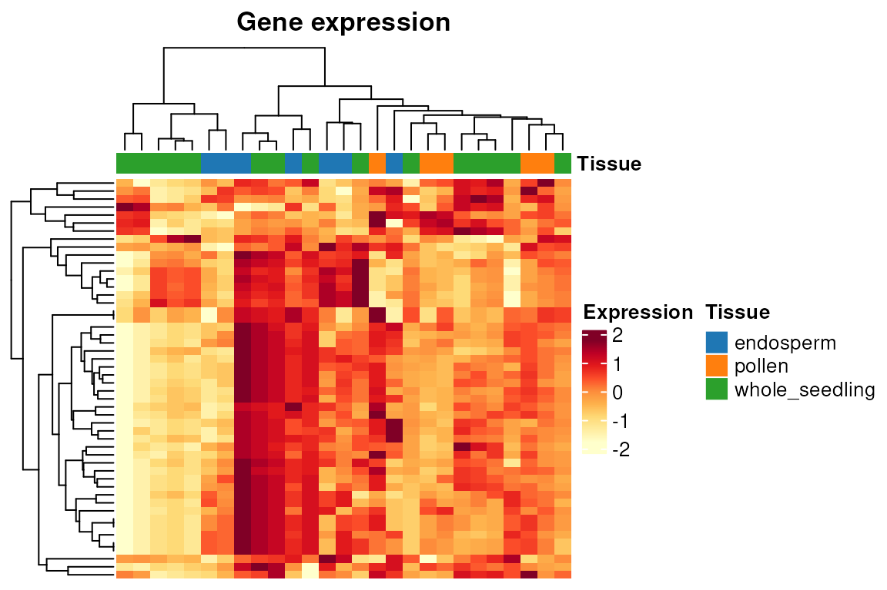

**Principal component analysis (PCA):** the function
[`plot_PCA()`](../reference/plot_PCA.md) performs a PCA and plots
whatever pair of PCs users choose (PC1 and PC2 by default), as well the
percentage of variance explained by each PC.

[`plot_PCA`](../reference/plot_PCA.md)`(``final_exp``)`

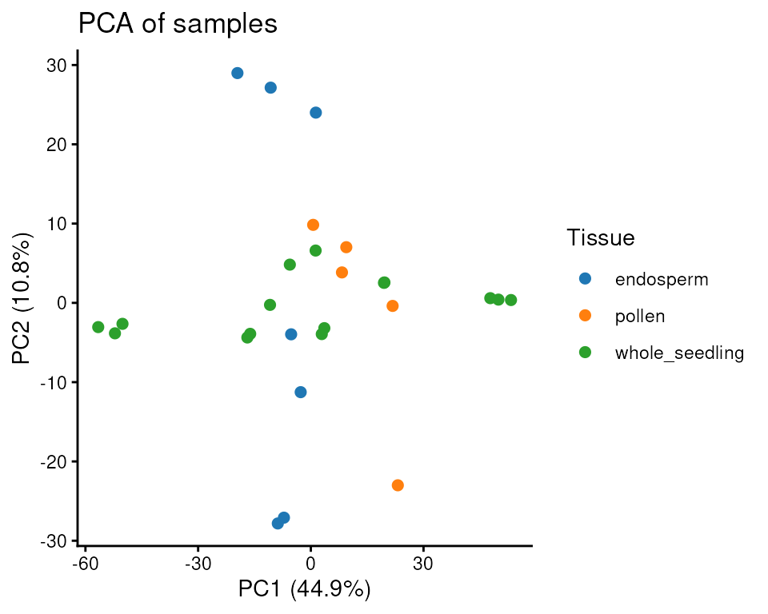

## Gene coexpression network inference

Now that we have our filtered and normalized expression data, we can
reconstruct a gene coexpression network (GCN) with the WGCNA algorithm
(Langfelder and Horvath 2008). First of all, we need to identify the
most suitable $`\beta`$ power that makes the network satisfy the
scale-free topology. We do that with the function
[`SFT_fit()`](../reference/SFT_fit.md). Correlation values are raised to
a power $`\beta`$ to amplify their distances and, hence, to make the
module detection algorithm more powerful. The higher the value of
$`\beta`$, the closer to the scale-free topology the network is.
However, a very high $`\beta`$ power reduces mean connectivity, which is
not desired. To solve this trade-off, we pick the lowest $`\beta`$ power
above a certain threshold (by default in
[`SFT_fit()`](../reference/SFT_fit.md), 0.8). This makes the network
close to the scale-free topology without dramatically reducing the mean
connectivity.

`sft`` ``<-`` `[`SFT_fit`](../reference/SFT_fit.md)`(``final_exp``, net_type ``=`` ``"signed hybrid"``, cor_method ``=`` ``"pearson"``)`` ``## Power SFT.R.sq slope truncated.R.sq mean.k. median.k. max.k.`` ``## 1 3 0.220 -0.218 0.178 278.0 303.00 598.0`` ``## 2 4 0.416 -0.382 0.272 196.0 199.00 472.0`` ``## 3 5 0.573 -0.468 0.462 145.0 136.00 381.0`` ``## 4 6 0.675 -0.536 0.584 110.0 95.70 312.0`` ``## 5 7 0.748 -0.584 0.676 86.3 70.00 259.0`` ``## 6 8 0.791 -0.653 0.735 68.8 51.90 221.0`` ``## 7 9 0.803 -0.717 0.761 55.8 38.60 191.0`` ``## 8 10 0.815 -0.775 0.790 45.8 29.90 167.0`` ``## 9 11 0.821 -0.828 0.815 38.1 22.90 147.0`` ``## 10 12 0.838 -0.874 0.850 32.0 17.90 130.0`` ``## 11 13 0.847 -0.913 0.876 27.2 14.30 116.0`` ``## 12 14 0.856 -0.943 0.893 23.2 11.80 104.0`` ``## 13 15 0.875 -0.973 0.913 20.0 9.79 93.0`` ``## 14 16 0.892 -0.997 0.937 17.3 8.00 83.9`` ``## 15 17 0.897 -1.020 0.941 15.1 6.75 76.0`` ``## 16 18 0.891 -1.070 0.948 13.3 5.79 69.7`` ``## 17 19 0.888 -1.100 0.950 11.7 4.96 64.2`` ``## 18 20 0.888 -1.130 0.957 10.4 4.27 59.4`` ``sft``$``power`` ``## [1] 9`` ``power`` ``<-`` ``sft``$``power`

As we can see, the optimal power is 9. However, we **strongly
recommend** a visual inspection of the simulation of different $`\beta`$
powers, as WGCNA can fail to return the most appropriate $`\beta`$ power
in some cases.[^3] The function [`SFT_fit()`](../reference/SFT_fit.md)
automatically saves a ggplot object in the second element of the
resulting list. To visualize it, you simply have to access the plot.

`sft``$``plot`

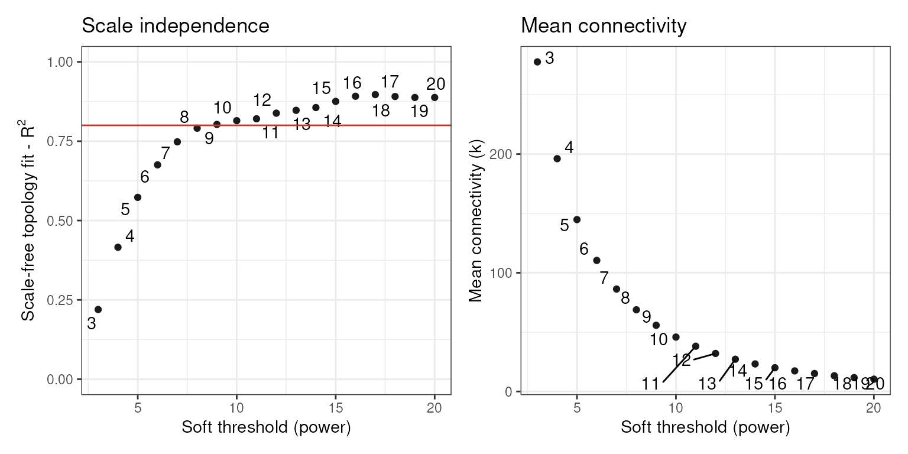

Now, we can use the power calculated by
[`SFT_fit()`](../reference/SFT_fit.md) to infer the GCN. The function
[`exp2gcn()`](../reference/exp2gcn.md) infers a GCN and outputs a list
of 7 elements, each of which will be used by other functions in the
analysis pipeline.

`net`` ``<-`` `[`exp2gcn`](../reference/exp2gcn.md)`(`` `` ``final_exp``, net_type ``=`` ``"signed hybrid"``, SFTpower ``=`` ``power``, `` `` cor_method ``=`` ``"pearson"`` ``)`` ``## ..connectivity..`` ``## ..matrix multiplication (system BLAS)..`` ``## ..normalization..`` ``## ..done.`` `[`names`](https://rdrr.io/r/base/names.html)`(``net``)`` ``## [1] "adjacency_matrix" "MEs" "genes_and_modules" `` ``## [4] "kIN" "correlation_matrix" "params" `` ``## [7] "dendro_plot_objects"`

The function [`exp2gcn()`](../reference/exp2gcn.md) saves objects in the
last element of the resulting list that can be subsequently used to plot
common figures in GCN papers. The figures are publication-ready and
display i. a dendrogram of genes and modules; ii. heatmap of pairwise
correlations between module eigengenes.

`# Dendro and colors`` `[`plot_dendro_and_colors`](../reference/plot_dendro_and_colors.md)`(``net``)`

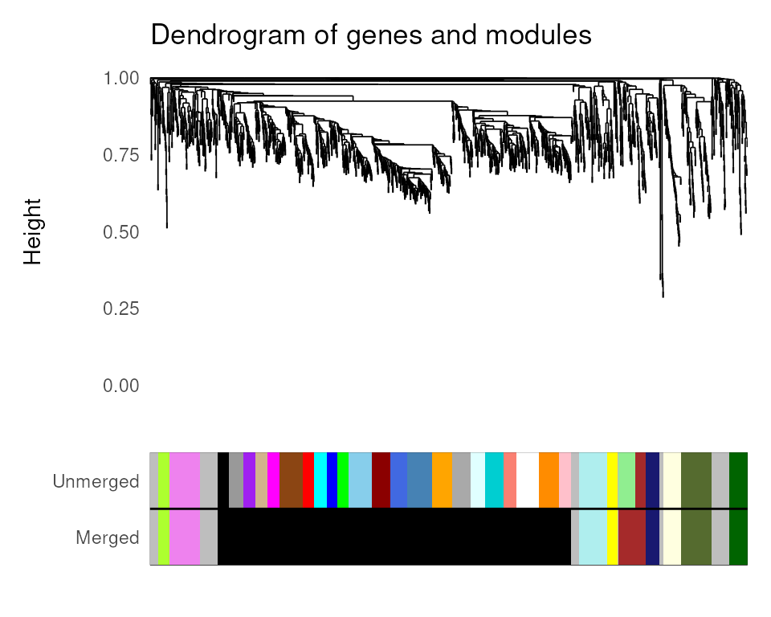

`# Eigengene networks`` `[`plot_eigengene_network`](../reference/plot_eigengene_network.md)`(``net``)`

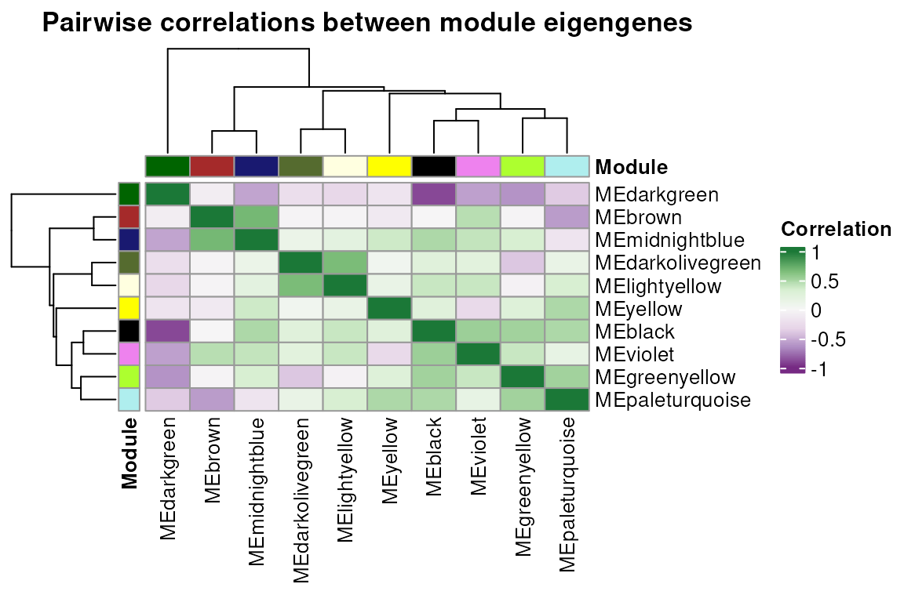

Let’s see the number of genes per module.

[`plot_ngenes_per_module`](../reference/plot_ngenes_per_module.md)`(``net``)`

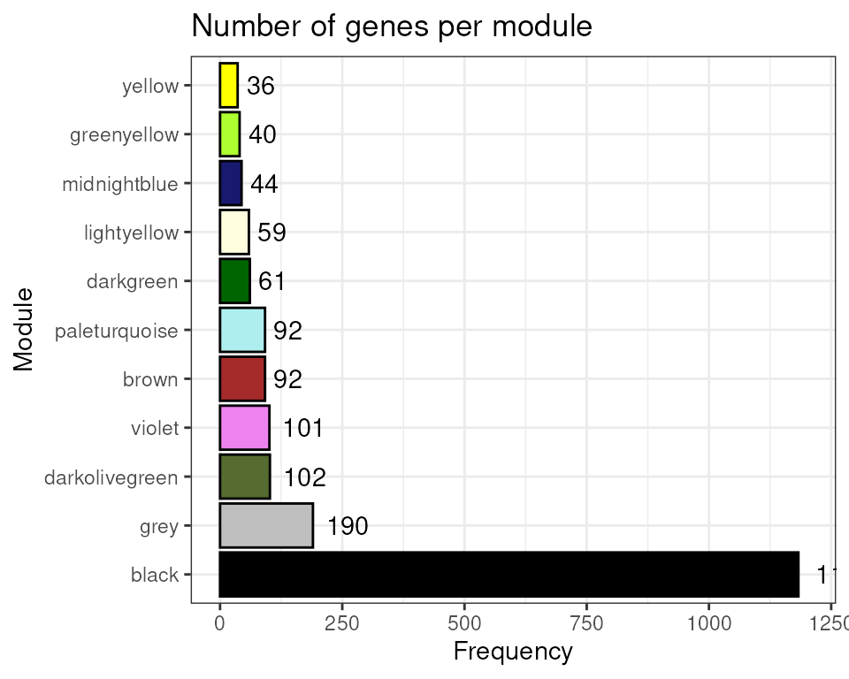

## Gene coexpression network analysis

Now that we have our coexpression network, we can start exploring some
of its properties.

### Assessing module stability

The function [`module_stability()`](../reference/module_stability.md)
allows users to check if the identified coexpression modules are stable
(i.e., if they can resist removal of a particular sample). This function
will resample the data set and rerun the module detection algorithm *n*
times (default: 30) and return a PDF figure displaying a gene dendrogram
and colors representing modules identified in each run. By looking at
the figure, you can detect if a particular module is only found in a
very small fraction of the runs, which suggests instability. Here, we
will perform only 5 resampling runs for demonstration purposes.[^4]

[`module_stability`](../reference/module_stability.md)`(``final_exp``, ``net``, nRuns ``=`` ``5``)`` ``## ...working on run 1 ..`` ``## ...working on run 2 ..`` ``## ...working on run 3 ..`` ``## ...working on run 4 ..`` ``## ...working on run 5 ..`` ``## ...working on run 6 ..`

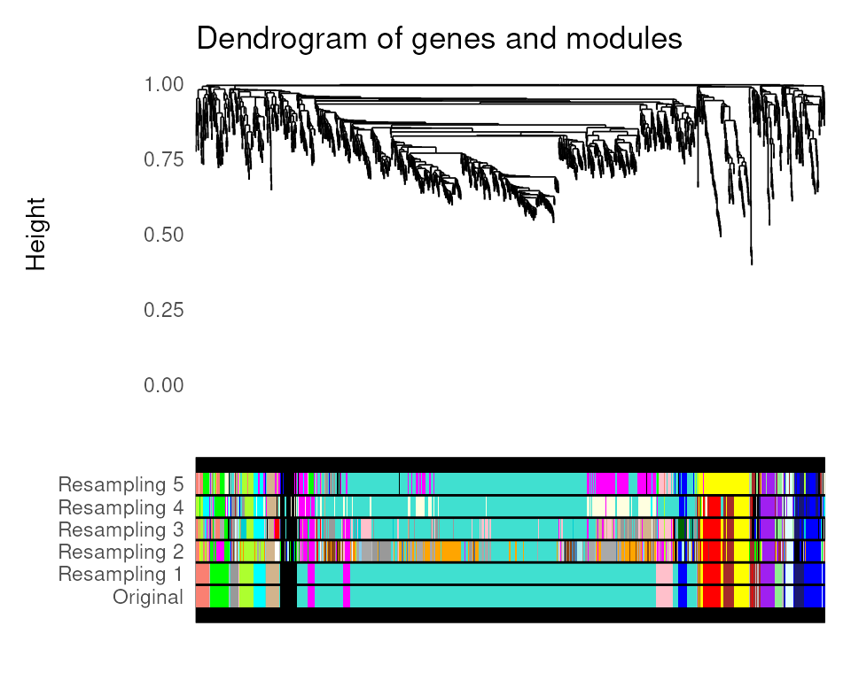

### Module-trait associations

The function [`module_trait_cor()`](../reference/module_trait_cor.md)
can be used to calculate module-trait correlations. This analysis is
useful to identify modules that are positively or negatively correlated
with particular traits, which means that their gene expression levels go
up or down in these conditions. Here, tissues will be considered traits,
so we want to identify groups of genes whose expression levels are
inhibited or induced in particular tissues. Alternatively, one can use
continuous variables (e.g., metabolite content, protein concentration,
height) or discrete variables (e.g., disease index) as traits.[^5]

`MEtrait`` ``<-`` `[`module_trait_cor`](../reference/module_trait_cor.md)`(``exp ``=`` ``final_exp``, MEs ``=`` ``net``$``MEs``)`` `[`head`](https://rdrr.io/r/utils/head.html)`(``MEtrait``)`` ``## ME trait cor pvalue group`` ``## 1 MEblack endosperm -0.166480994 0.4065715 Tissue`` ``## 2 MEblack pollen 0.213691004 0.2845053 Tissue`` ``## 3 MEblack whole_seedling -0.020227505 0.9202318 Tissue`` ``## 4 MEbrown endosperm 0.003843583 0.9848197 Tissue`` ``## 5 MEbrown pollen -0.020729547 0.9182584 Tissue`` ``## 6 MEbrown whole_seedling 0.012815311 0.9494147 Tissue`

Next, you can use the function
[`plot_module_trait_cor()`](../reference/plot_module_trait_cor.md) to
visualize the output of
[`module_trait_cor()`](../reference/module_trait_cor.md) as follows:

[`plot_module_trait_cor`](../reference/plot_module_trait_cor.md)`(``MEtrait``)`

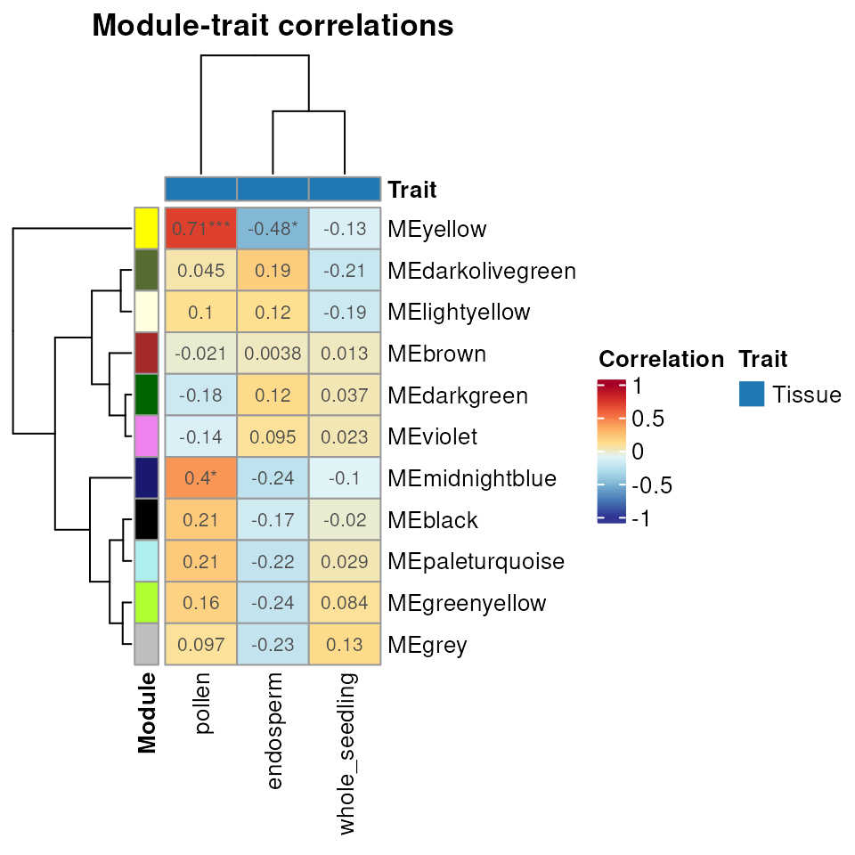

### Visualizing module expression profile

The heatmap above shows that genes in the *yellow* module are negatively
correlated with endosperm samples. We can visually explore it with
[`plot_expression_profile()`](../reference/plot_expression_profile.md).

[`plot_expression_profile`](../reference/plot_expression_profile.md)`(`` `` exp ``=`` ``final_exp``, `` `` net ``=`` ``net``, `` `` plot_module ``=`` ``TRUE``, `` `` modulename ``=`` ``"yellow"`` ``)`

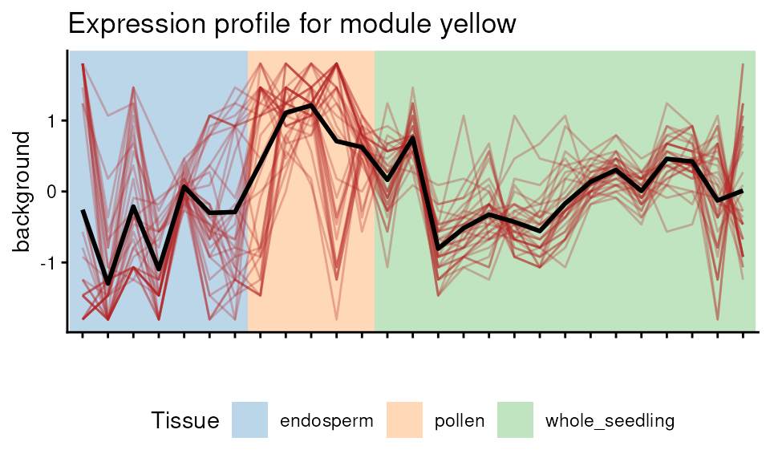

### Enrichment analysis

After identifying modules that are inhibited or enhanced in particular
tissues, users would likely want to find to which biological processes
(e.g., GO biological process) or pathways (e.g., Reactome, KEGG, MapMan)
these genes are related. This can be done with enrichment analyses,
which can uncover terms that are found more than expected by chance in a
module.

The easiest way to accomplish this is to use the function
[`module_enrichment()`](../reference/module_enrichment.md), which
performs enrichment analysis for all modules at once. To illustrate it,
we will scan coexpression modules for enriched protein domains using all
genes in the network as background. The Interpro annotation was
downloaded from the PLAZA 4.0 Monocots database (Van Bel et al. 2018).

`# Enrichment analysis for conserved protein domains (Interpro)`` `[`data`](https://rdrr.io/r/utils/data.html)`(``zma.interpro``)`` ``interpro_enrichment`` ``<-`` `[`module_enrichment`](../reference/module_enrichment.md)`(`` `` net ``=`` ``net``, `` `` background_genes ``=`` `[`rownames`](https://rdrr.io/r/base/colnames.html)`(``final_exp``)``,`` `` annotation ``=`` ``zma.interpro`` ``)`` ``## Enrichment analysis for module black...`` ``## Enrichment analysis for module brown...`` ``## Enrichment analysis for module darkgreen...`` ``## Enrichment analysis for module darkolivegreen...`` ``## Enrichment analysis for module greenyellow...`` ``## Enrichment analysis for module lightyellow...`` ``## Enrichment analysis for module midnightblue...`` ``## Enrichment analysis for module paleturquoise...`` ``## Enrichment analysis for module violet...`` ``## Enrichment analysis for module yellow...`` `` ``# Print results without geneIDs for better visualization`` ``interpro_enrichment``[``, ``-``6``]`` ``## term genes all pval padj`` ``## 184 Histone H2A/H2B/H3 43 44 2.155952e-09 4.840112e-07`` ``## 185 Histone H2B 14 14 6.217795e-04 3.489738e-02`` ``## 186 Histone H3/CENP-A 15 15 3.659921e-04 2.347578e-02`` ``## 187 Histone H4 15 15 3.659921e-04 2.347578e-02`` ``## 188 Histone-fold 58 60 1.083394e-11 4.864438e-09`` ``## 326 Ribosomal protein L2 domain 2 18 18 7.448332e-05 6.688602e-03`` ``## 395 Translation protein SH3-like domain 22 22 8.872064e-06 1.327852e-03`` ``## 396 Translation protein, beta-barrel domain 26 27 1.235834e-05 1.387224e-03`` ``## 299 Protein kinase domain 5 18 1.202246e-04 2.699043e-02`` ``## 448 Zinc finger, RING/FYVE/PHD-type 5 18 1.202246e-04 2.699043e-02`` ``## 46 Aquaporin transporter 3 5 9.644015e-05 4.330163e-02`` ``## category module`` ``## 184 Description black`` ``## 185 Description black`` ``## 186 Description black`` ``## 187 Description black`` ``## 188 Description black`` ``## 326 Description black`` ``## 395 Description black`` ``## 396 Description black`` ``## 299 Description lightyellow`` ``## 448 Description lightyellow`` ``## 46 Description midnightblue`

As we can see, two modules are enriched in genes with particular protein
domains. We could get the same result with the function
[`enrichment_analysis()`](../reference/enrichment_analysis.md), which
performs enrichment analysis for a user-defined gene set instead of all
modules. [^6]

### Hub gene identification

Hub genes are often identified using two different metrics: **module
membership (MM)** (i.e., correlation of a gene to its module eigengene)
and **degree** (i.e., sum of connection weights of a gene to all other
genes in the module). Some researchers consider the top 10% genes with
the highest degree as hubs, while others consider those with MM \> 0.8.
To avoid false positives, `BioNERO`’s algorithm combines both metrics
and defines hub genes as the top 10% genes with highest degree that have
MM \> 0.8. Hubs can be identified with the function
[`get_hubs_gcn()`](../reference/get_hubs_gcn.md).

`hubs`` ``<-`` `[`get_hubs_gcn`](../reference/get_hubs_gcn.md)`(``final_exp``, ``net``)`` `[`head`](https://rdrr.io/r/utils/head.html)`(``hubs``)`` ``## Gene Module kWithin`` ``## 1 Zm00001d033147 black 188.3864`` ``## 2 Zm00001d049790 black 181.4522`` ``## 3 Zm00001d005649 black 180.7062`` ``## 4 Zm00001d045448 black 180.6744`` ``## 5 Zm00001d008203 black 178.7147`` ``## 6 Zm00001d023340 black 177.7553`

### Extracting subgraphs

Subgraph extraction can be particularly useful to visualize specific
modules, and it can be done with the function
[`get_edge_list()`](../reference/get_edge_list.md). The function returns
the subgraph as an edge list. Users can also extract an edge list for a
particular gene set instead of a module.

`edges`` ``<-`` `[`get_edge_list`](../reference/get_edge_list.md)`(``net``, module``=``"midnightblue"``)`` `[`head`](https://rdrr.io/r/utils/head.html)`(``edges``)`` ``## Gene1 Gene2 Weight`` ``## 45 Zm00001d001857 Zm00001d002384 0.9401886`` ``## 89 Zm00001d001857 Zm00001d002690 0.9675345`` ``## 90 Zm00001d002384 Zm00001d002690 0.9185426`` ``## 133 Zm00001d001857 Zm00001d003962 0.7178340`` ``## 134 Zm00001d002384 Zm00001d003962 0.6534956`` ``## 135 Zm00001d002690 Zm00001d003962 0.6840004`

The function [`get_edge_list()`](../reference/get_edge_list.md) returns
a fully connected subgraph for the specified module or gene set.
However, filtering weak correlations is desirable and can be
accomplished by setting the argument `filter = TRUE`, which will remove
edges based on one of optimal scale-free topology fit (default),
p-value, Z-score, or an arbitrary minimum correlation coefficient. [^7]
For more details details, check `?get_edge_list()`.

`# Remove edges based on optimal scale-free topology fit`` ``edges_filtered`` ``<-`` `[`get_edge_list`](../reference/get_edge_list.md)`(``net``, module ``=`` ``"midnightblue"``, filter ``=`` ``TRUE``)`` ``## The correlation threshold that best fits the scale-free topology is 0.7`` `[`dim`](https://rdrr.io/r/base/dim.html)`(``edges_filtered``)`` ``## [1] 588 3`` `` ``# Remove edges based on p-value`` ``edges_filtered`` ``<-`` `[`get_edge_list`](../reference/get_edge_list.md)`(`` `` ``net``, module ``=`` ``"midnightblue"``,`` `` filter ``=`` ``TRUE``, method ``=`` ``"pvalue"``, `` `` nSamples ``=`` `[`ncol`](https://rdrr.io/r/base/nrow.html)`(``final_exp``)`` ``)`` `[`dim`](https://rdrr.io/r/base/dim.html)`(``edges_filtered``)`` ``## [1] 921 3`` `` ``# Remove edges based on minimum correlation`` ``edges_filtered`` ``<-`` `[`get_edge_list`](../reference/get_edge_list.md)`(`` `` ``net``, module ``=`` ``"midnightblue"``, `` `` filter ``=`` ``TRUE``, method ``=`` ``"min_cor"``, rcutoff ``=`` ``0.7`` ``)`` `[`dim`](https://rdrr.io/r/base/dim.html)`(``edges_filtered``)`` ``## [1] 588 3`

### Network visualization

As we now have an edge list for a module, let’s visualize it with the
function [`plot_gcn()`](../reference/plot_gcn.md). By default, this
function only labels the top 5 hubs (or less if there are less than 5
hubs). However, this can be customized according to the user’s
preference (see [`?plot_gcn`](../reference/plot_gcn.md) for more
information).

[`plot_gcn`](../reference/plot_gcn.md)`(`` `` edgelist_gcn ``=`` ``edges_filtered``, `` `` net ``=`` ``net``, `` `` color_by ``=`` ``"module"``, `` `` hubs ``=`` ``hubs`` ``)`

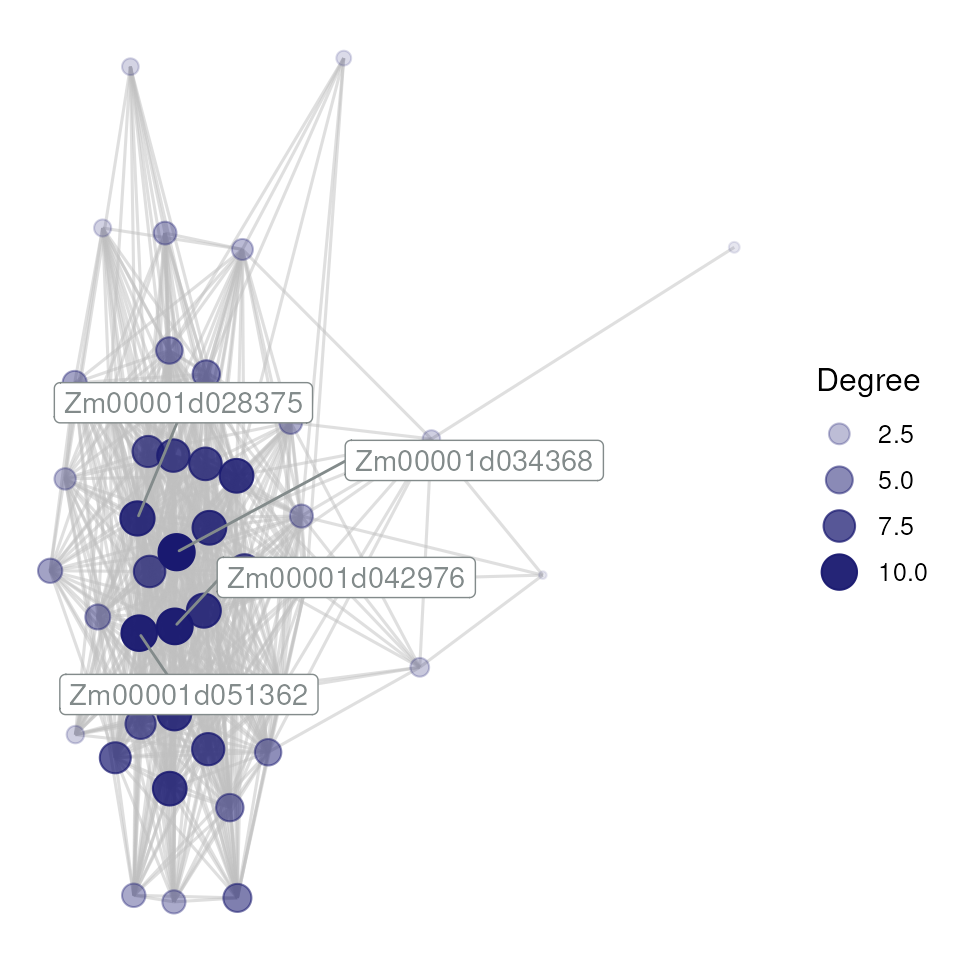

Networks can also be visualized interactively by setting
`interactive = TRUE` in `plot_gcn`.

[`plot_gcn`](../reference/plot_gcn.md)`(`` `` edgelist_gcn ``=`` ``edges_filtered``, `` `` net ``=`` ``net``,`` `` color_by ``=`` ``"module"``,`` `` hubs ``=`` ``hubs``,`` `` interactive ``=`` ``TRUE``,`` `` dim_interactive ``=`` `[`c`](https://rdrr.io/r/base/c.html)`(``500``, ``500``)`` ``)`

### Network statistics

Finally, the function [`net_stats()`](../reference/net_stats.md) can be
used to calculate the main network statistics (or properties, or
indices), namely: *connectivity*, *scaled connectivity*, *clustering
coefficient*, *maximum adjacency ratio*, *density*, *centralization*,
*heterogeneity*, *diameter*, *betweenness* (optional), and *closeness*
(optional).

Depending on your system capacities and network size, this may take a
very long time. Hence, if you are willing to calculate network
statistics for your data set, grab a cup of coffee, because the waiting
may be long.

## Session information

This vignette was created under the following conditions:

[`sessionInfo`](https://rdrr.io/r/utils/sessionInfo.html)`(``)`` ``## R version 4.6.1 (2026-06-24)`` ``## Platform: x86_64-pc-linux-gnu`` ``## Running under: Ubuntu 24.04.4 LTS`` ``## `` ``## Matrix products: default`` ``## BLAS: /usr/lib/x86_64-linux-gnu/openblas-pthread/libblas.so.3 `` ``## LAPACK: /usr/lib/x86_64-linux-gnu/openblas-pthread/libopenblasp-r0.3.26.so; LAPACK version 3.12.0`` ``## `` ``## locale:`` ``## [1] LC_CTYPE=en_US.UTF-8 LC_NUMERIC=C `` ``## [3] LC_TIME=en_US.UTF-8 LC_COLLATE=en_US.UTF-8 `` ``## [5] LC_MONETARY=en_US.UTF-8 LC_MESSAGES=en_US.UTF-8 `` ``## [7] LC_PAPER=en_US.UTF-8 LC_NAME=C `` ``## [9] LC_ADDRESS=C LC_TELEPHONE=C `` ``## [11] LC_MEASUREMENT=en_US.UTF-8 LC_IDENTIFICATION=C `` ``## `` ``## time zone: UTC`` ``## tzcode source: system (glibc)`` ``## `` ``## attached base packages:`` ``## [1] stats graphics grDevices utils datasets methods base `` ``## `` ``## other attached packages:`` ``## [1] BioNERO_1.21.0 BiocStyle_2.41.0`` ``## `` ``## loaded via a namespace (and not attached):`` ``## [1] RColorBrewer_1.1-3 ggdendro_0.2.0 `` ``## [3] rstudioapi_0.19.0 jsonlite_2.0.0 `` ``## [5] shape_1.4.6.1 NetRep_1.2.10 `` ``## [7] magrittr_2.0.5 farver_2.1.2 `` ``## [9] rmarkdown_2.32 GlobalOptions_0.1.4 `` ``## [11] fs_2.1.0 ragg_1.5.2 `` ``## [13] vctrs_0.7.3 memoise_2.0.1 `` ``## [15] base64enc_0.1-6 BiocBaseUtils_1.15.1 `` ``## [17] htmltools_0.5.9 S4Arrays_1.13.0 `` ``## [19] dynamicTreeCut_1.63-1 SparseArray_1.13.2 `` ``## [21] Formula_1.2-6 sass_0.4.10 `` ``## [23] bslib_0.12.0 htmlwidgets_1.6.4 `` ``## [25] desc_1.4.3 plyr_1.8.9 `` ``## [27] impute_1.87.0 cachem_1.1.0 `` ``## [29] networkD3_0.4.1 igraph_2.3.3 `` ``## [31] lifecycle_1.0.5 ggnetwork_0.5.14 `` ``## [33] iterators_1.0.14 pkgconfig_2.0.3 `` ``## [35] Matrix_1.7-6 R6_2.6.1 `` ``## [37] fastmap_1.2.0 MatrixGenerics_1.25.0 `` ``## [39] clue_0.3-68 digest_0.6.39 `` ``## [41] colorspace_2.1-3 patchwork_1.3.2 `` ``## [43] AnnotationDbi_1.75.2 S4Vectors_0.51.9 `` ``## [45] GENIE3_1.35.0 textshaping_1.0.5 `` ``## [47] Hmisc_5.3-0 GenomicRanges_1.65.4 `` ``## [49] RSQLite_3.53.3 labeling_0.4.3 `` ``## [51] mgcv_1.9-4 httr_1.4.9 `` ``## [53] abind_1.4-8 compiler_4.6.1 `` ``## [55] withr_3.0.3 bit64_4.8.6 `` ``## [57] doParallel_1.0.17 htmlTable_2.5.0 `` ``## [59] S7_0.2.2 backports_1.5.1 `` ``## [61] BiocParallel_1.47.0 DBI_1.3.0 `` ``## [63] intergraph_2.0-4 MASS_7.3-66 `` ``## [65] DelayedArray_0.39.6 rjson_0.2.23 `` ``## [67] tools_4.6.1 foreign_0.8-91 `` ``## [69] otel_0.2.0 nnet_7.3-21 `` ``## [71] glue_1.8.1 nlme_3.1-171 `` ``## [73] grid_4.6.1 checkmate_2.3.4 `` ``## [75] cluster_2.1.8.3 reshape2_1.4.5 `` ``## [77] generics_0.1.4 sva_3.59.0 `` ``## [79] gtable_0.3.6 preprocessCore_1.75.1 `` ``## [81] sna_2.8 data.table_1.18.6.1 `` ``## [83] WGCNA_1.74 XVector_0.53.0 `` ``## [85] BiocGenerics_0.59.12 ggrepel_0.9.8 `` ``## [87] foreach_1.5.2 pillar_1.11.1 `` ``## [89] stringr_1.6.0 limma_3.99.0 `` ``## [91] genefilter_1.95.0 circlize_0.4.18 `` ``## [93] splines_4.6.1 dplyr_1.2.1 `` ``## [95] lattice_0.23-1 survival_3.8-11 `` ``## [97] bit_4.6.0 annotate_1.91.0 `` ``## [99] tidyselect_1.2.1 locfit_1.5-9.12 `` ``## [101] ComplexHeatmap_2.29.0 Biostrings_2.81.9 `` ``## [103] knitr_1.52 gridExtra_2.3.1 `` ``## [105] bookdown_0.48 IRanges_2.47.5 `` ``## [107] Seqinfo_1.3.2 edgeR_4.99.4 `` ``## [109] SummarizedExperiment_1.43.0 RhpcBLASctl_0.23-42 `` ``## [111] stats4_4.6.1 xfun_0.60 `` ``## [113] Biobase_2.73.2 statmod_1.5.2 `` ``## [115] matrixStats_1.5.0 stringi_1.8.9 `` ``## [117] statnet.common_4.13.0 yaml_2.3.12 `` ``## [119] minet_3.71.0 evaluate_1.0.5 `` ``## [121] codetools_0.2-20 data.tree_1.2.0 `` ``## [123] tibble_3.3.1 BiocManager_1.30.27 `` ``## [125] cli_3.6.6 rpart_4.1.27 `` ``## [127] xtable_1.8-8 systemfonts_1.3.2 `` ``## [129] jquerylib_0.1.4 network_1.20.0 `` ``## [131] Rcpp_1.1.2 coda_0.19-4.1 `` ``## [133] png_0.1-9 fastcluster_1.3.0 `` ``## [135] XML_3.99-0.24 parallel_4.6.1 `` ``## [137] pkgdown_2.2.1 ggplot2_4.0.3 `` ``## [139] blob_1.3.0 scales_1.4.0 `` ``## [141] crayon_1.5.3 GetoptLong_1.1.1 `` ``## [143] rlang_1.3.0 KEGGREST_1.53.6`

## References

Langfelder, Peter, and Steve Horvath. 2008. “WGCNA: an R package for
weighted correlation network analysis.” *BMC Bioinformatics* 9 (1): 559.
<https://doi.org/10.1186/1471-2105-9-559>.

Love, Michael I., Wolfgang Huber, and Simon Anders. 2014. “Moderated
estimation of fold change and dispersion for RNA-seq data with DESeq2.”
*Genome Biology* 15 (12): 1–21.
<https://doi.org/10.1186/s13059-014-0550-8>.

Oldham, Michael C., Peter Langfelder, and Steve Horvath. 2012. “Network
methods for describing sample relationships in genomic datasets:
application to Huntington’s disease.” *BMC Systems Biology* 6 (1): 1.
<https://doi.org/10.1186/1752-0509-6-63>.

Parsana, Princy, Claire Ruberman, Andrew E. Jaffe, Michael C. Schatz,
Alexis Battle, and Jeffrey T. Leek. 2019. “Addressing confounding
artifacts in reconstruction of gene co-expression networks.” *Genome
Biology* 20 (1): 94. <https://doi.org/10.1186/s13059-019-1700-9>.

Petereit, Juli, Sebastian Smith, Frederick C. Harris, and Karen A.
Schlauch. 2016. “petal: Co-expression network modelling in R.” *BMC
Systems Biology* 10 (S2): 51.
<https://doi.org/10.1186/s12918-016-0298-8>.

Russo, Pedro S. T., Gustavo R. Ferreira, Lucas E. Cardozo, et al. 2018.
“CEMiTool: a Bioconductor package for performing comprehensive modular
co-expression analyses.” *BMC Bioinformatics* 19 (1): 56.
<https://doi.org/10.1186/s12859-018-2053-1>.

Shin, Junha, Harald Marx, Alicia Richards, et al. 2020. “A network-based
comparative framework to study conservation and divergence of proteomes
in plant phylogenies.” *Nucleic Acids Research*, 1–23.
<https://doi.org/10.1093/nar/gkaa1041>.

Van Bel, Michiel, Tim Diels, Emmelien Vancaester, et al. 2018. “PLAZA
4.0: An integrative resource for functional, evolutionary and
comparative plant genomics.” *Nucleic Acids Research* 46 (D1): D1190–96.
<https://doi.org/10.1093/nar/gkx1002>.

[^1]: **NOTE:** In case you have many tab-separated expression tables in
    a directory, `BioNERO` has a helper function named
    [`dfs2one()`](../reference/dfs2one.md) to load all these files and
    combine them into a single data frame.

[^2]: **NOTE:** Here, we are using TPM-normalized data. If you have
    expression data as raw read counts, set the argument
    `vstransform = TRUE` in
    [`exp_preprocess()`](../reference/exp_preprocess.md). This will
    apply DESeq2’s variance stabilizing transformation (Love et al.
    2014) to your count data.

[^3]: **PRO TIP:** If your $`\beta`$ power is too low (say below 6),
    look at the plot as a sanity check.

[^4]: **NOTE:** The calculations performed by this function may take a
    long time depending on the your network size. Use it only if you
    have some reason to suspect that the modules are highly dependent on
    a particular set of samples.

[^5]: **NOTE:** The function
    [`gene_significance()`](../reference/gene_significance.md) works
    just like [`module_trait_cor()`](../reference/module_trait_cor.md),
    but it correlates individual genes (not the whole module) to traits.
    This function is very useful if you have a set of candidate genes
    and you want to find which of them are more associated with the
    trait of interest. See `?gene_significance()` for more details.

[^6]: **NOTE:** The functions
    [`module_enrichment()`](../reference/module_enrichment.md) and
    [`enrichment_analysis()`](../reference/enrichment_analysis.md) can
    be parallelized with `BiocParallel` to increase speed. The default
    parallel back-end is *SerialParam()*, but this can be modified in
    the argument `bp_param`.

[^7]: **PRO TIP:** Generally, we advise you to filter by optimal
    scale-free topology fit (default). However, if you want to specify
    your own correlation filter for some reason (e.g., visualization),
    we **strongly recommend** using the function
    [`check_SFT()`](../reference/check_SFT.md) to check if your
    resulting graph satisfies the scale-free topology. If it does not,
    then your graph does not resemble *real* biological networks and,
    hence, one cannot trust it for biological interpretations.
