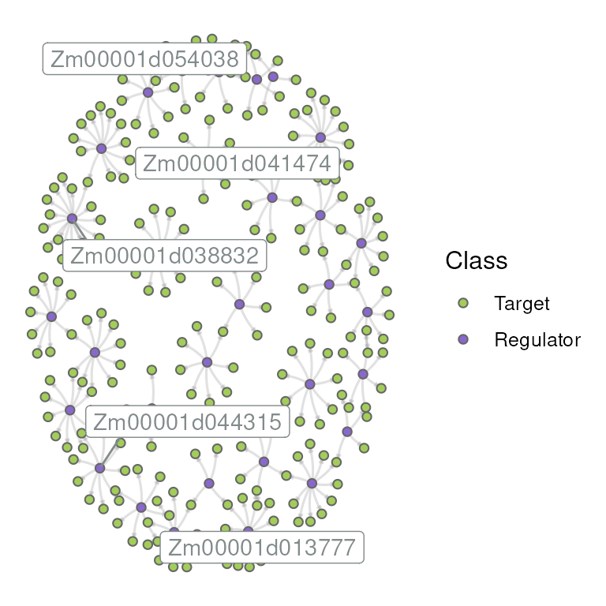

# Gene regulatory network inference

## Installation

`if``(``!`[`requireNamespace`](https://rdrr.io/r/base/ns-load.html)`(``'BiocManager'``, quietly ``=`` ``TRUE``)``)`` `` `[`install.packages`](https://rdrr.io/r/utils/install.packages.html)`(``'BiocManager'``)`` `` ``BiocManager``::`[`install`](https://bioconductor.github.io/BiocManager/reference/install.html)`(``"BioNERO"``)`

`# Load package after installation`` `[`library`](https://rdrr.io/r/base/library.html)`(`[`BioNERO`](https://github.com/almeidasilvaf/BioNERO)`)`` `[`set.seed`](https://rdrr.io/r/base/Random.html)`(``123``)`` ``# for reproducibility`

## Introduction and algorithm description

In the previous vignette, we explored all aspects of gene coexpression
networks (GCNs), which are represented as **undirected weighted
graphs**. It is **undirected** because, for a given link between *gene
A* and *gene B*, we can only say that these genes are coexpressed, but
we cannot know whether *gene A* controls *gene B* or otherwise. Further,
**weighted** means that some coexpression relationships between gene
pairs are stronger than others. In this vignette, we will demonstrate
how to infer gene regulatory networks (GRNs) from expression data with
BioNERO. GRNs display interactions between regulators (e.g.,
transcription factors or miRNAs) and their targets (e.g., genes). Hence,
they are represented as **directed unweighted graphs**.

Numerous algorithms have been developed to infer GRNs from expression
data. However, the algorithm performances are highly dependent on the
benchmark data set. To solve this uncertainty, Marbach et al. (2012)
proposed the application of the *“wisdom of the crowds”* principle to
GRN inference. This approach consists in inferring GRNs with different
algorithms, ranking the interactions identified by each method, and
calculating the average rank for each interaction across all algorithms
used. This way, we can have consensus, high-confidence edges to be used
in biological interpretations. For that, `BioNERO` implements three
popular algorithms: GENIE3 (Huynh-Thu et al. 2010), ARACNE (Margolin et
al. 2006) and CLR (Faith et al. 2007).

## Data preprocessing

Before inferring the GRN, we will preprocess the expression data the
same way we did in the previous vignette.

`# Load example data set`` `[`data`](https://rdrr.io/r/utils/data.html)`(``zma.se``)`` `` ``# Preprocess the expression data`` ``final_exp`` ``<-`` `[`exp_preprocess`](../reference/exp_preprocess.md)`(`` `` ``zma.se``, `` `` min_exp ``=`` ``10``, `` `` variance_filter ``=`` ``TRUE``, `` `` n ``=`` ``2000`` ``)`` ``## Number of removed samples: 1`

## Gene regulatory network inference

`BioNERO` requires only 2 objects for GRN inference: the **expression
data** (SummarizedExperiment, matrix or data frame) and a character
vector of **regulators** (transcription factors or miRNAs). The
transcription factors used in this vignette were downloaded from
PlantTFDB 4.0 (Jin et al. 2017).

[`data`](https://rdrr.io/r/utils/data.html)`(``zma.tfs``)`` `[`head`](https://rdrr.io/r/utils/head.html)`(``zma.tfs``)`` ``## Gene Family`` ``## 6 Zm00001d022525 Dof`` ``## 25 Zm00001d037605 GATA`` ``## 28 Zm00001d049540 NAC`` ``## 45 Zm00001d042287 MYB`` ``## 46 Zm00001d042288 NAC`` ``## 54 Zm00001d039371 TCP`

### Consensus GRN inference

Inferring GRNs based on the *wisdom of the crowds* principle can be done
with a single function: [`exp2grn()`](../reference/exp2grn.md). This
function will infer GRNs with GENIE3, ARACNE and CLR, calculate average
ranks for each interaction and filter the resulting network based on the
optimal scale-free topology (SFT) fit. In the filtering step, *n*
different networks are created by subsetting the top *n* quantiles. For
instance, if a network of 10,000 edges is given as input with
`nsplit = 10`, 10 different networks will be created: the first with
1,000 edges, the second with 2,000 edges, and so on, with the last
network being the original input network. Then, for each network, the
function will calculate the SFT fit and select the best fit.

`# Using 10 trees for demonstration purposes. Use the default: 1000`` ``grn`` ``<-`` `[`exp2grn`](../reference/exp2grn.md)`(`` `` exp ``=`` ``final_exp``, `` `` regulators ``=`` ``zma.tfs``$``Gene``, `` `` nTrees ``=`` ``10`` ``)`` ``## The top number of edges that best fits the scale-free topology is 247`` `[`head`](https://rdrr.io/r/utils/head.html)`(``grn``)`` ``## Regulator Target`` ``## 290 Zm00001d041474 Zm00001d018986`` ``## 280 Zm00001d041474 Zm00001d006602`` ``## 281 Zm00001d041474 Zm00001d006942`` ``## 325 Zm00001d044315 Zm00001d043497`` ``## 65 Zm00001d013777 Zm00001d046996`` ``## 252 Zm00001d038832 Zm00001d021147`

### Algorithm-specific GRN inference

This section is directed to users who, for some reason (e.g.,
comparison, exploration), want to infer GRNs with particular algorithms.
The available algorithms are:

**GENIE3:** a regression-tree based algorithm that decomposes the
prediction of GRNs for *n* genes into *n* regression problems. For each
regression problem, the expression profile of a target gene is predicted
from the expression profiles of all other genes using random forests
(default) or extra-trees.

`# Using 10 trees for demonstration purposes. Use the default: 1000`` ``genie3`` ``<-`` `[`grn_infer`](../reference/grn_infer.md)`(`` `` ``final_exp``, `` `` method ``=`` ``"genie3"``, `` `` regulators ``=`` ``zma.tfs``$``Gene``, `` `` nTrees ``=`` ``10``)`` `[`head`](https://rdrr.io/r/utils/head.html)`(``genie3``)`` ``## Node1 Node2 Weight`` ``## 20352 Zm00001d041474 Zm00001d017881 0.5439514`` ``## 41340 Zm00001d034751 Zm00001d037111 0.5322394`` ``## 13037 Zm00001d034751 Zm00001d012407 0.4348469`` ``## 13207 Zm00001d045323 Zm00001d012513 0.4203583`` ``## 55378 Zm00001d028432 Zm00001d048693 0.4071160`` ``## 50200 Zm00001d013777 Zm00001d044212 0.3957483`` `[`dim`](https://rdrr.io/r/base/dim.html)`(``genie3``)`` ``## [1] 60136 3`

**ARACNE:** information-theoretic algorithm that aims to remove indirect
interactions inferred by coexpression.

`aracne`` ``<-`` `[`grn_infer`](../reference/grn_infer.md)`(``final_exp``, method ``=`` ``"aracne"``, regulators ``=`` ``zma.tfs``$``Gene``)`` `[`head`](https://rdrr.io/r/utils/head.html)`(``aracne``)`` ``## Node1 Node2 Weight`` ``## 23861 Zm00001d038832 Zm00001d021147 1.789818`` ``## 1758 Zm00001d038832 Zm00001d000432 1.692232`` ``## 11337 Zm00001d038832 Zm00001d011086 1.692232`` ``## 27014 Zm00001d011139 Zm00001d024274 1.674840`` ``## 51070 Zm00001d011139 Zm00001d045069 1.658043`` ``## 28387 Zm00001d038832 Zm00001d025784 1.641802`` `[`dim`](https://rdrr.io/r/base/dim.html)`(``aracne``)`` ``## [1] 411 3`

**CLR:** extension of the relevance networks algorithm that uses mutual
information to identify regulatory interactions.

`clr`` ``<-`` `[`grn_infer`](../reference/grn_infer.md)`(``final_exp``, method ``=`` ``"clr"``, regulators ``=`` ``zma.tfs``$``Gene``)`` `[`head`](https://rdrr.io/r/utils/head.html)`(``clr``)`` ``## Node1 Node2 Weight`` ``## 26302 Zm00001d046937 Zm00001d023376 12.70216`` ``## 11267 Zm00001d046937 Zm00001d011080 12.25336`` ``## 12540 Zm00001d041474 Zm00001d012007 10.74023`` ``## 51019 Zm00001d042263 Zm00001d045042 10.50925`` ``## 17810 Zm00001d041474 Zm00001d015811 10.33216`` ``## 29278 Zm00001d046937 Zm00001d026632 10.20075`` `[`dim`](https://rdrr.io/r/base/dim.html)`(``clr``)`` ``## [1] 26657 3`

Users can also infer GRNs with the 3 algorithms at once using the
function `exp_combined()`. The resulting edge lists are stored in a list
of 3 elements. [^1]

`grn_list`` ``<-`` `[`grn_combined`](../reference/grn_combined.md)`(``final_exp``, regulators ``=`` ``zma.tfs``$``Gene``, nTrees ``=`` ``10``)`` `[`head`](https://rdrr.io/r/utils/head.html)`(``grn_list``$``genie3``)`` ``## Node1 Node2 Weight`` ``## 12013 Zm00001d041474 Zm00001d011541 0.4629469`` ``## 30418 Zm00001d046568 Zm00001d027841 0.4289222`` ``## 33403 Zm00001d041474 Zm00001d030748 0.4140894`` ``## 6910 Zm00001d044315 Zm00001d006725 0.4103733`` ``## 22057 Zm00001d041474 Zm00001d018986 0.4020641`` ``## 45153 Zm00001d034751 Zm00001d039733 0.3935705`` `[`head`](https://rdrr.io/r/utils/head.html)`(``grn_list``$``aracne``)`` ``## Node1 Node2 Weight`` ``## 23861 Zm00001d038832 Zm00001d021147 1.789818`` ``## 1758 Zm00001d038832 Zm00001d000432 1.692232`` ``## 11337 Zm00001d038832 Zm00001d011086 1.692232`` ``## 27014 Zm00001d011139 Zm00001d024274 1.674840`` ``## 51070 Zm00001d011139 Zm00001d045069 1.658043`` ``## 28387 Zm00001d038832 Zm00001d025784 1.641802`` `[`head`](https://rdrr.io/r/utils/head.html)`(``grn_list``$``clr``)`` ``## Node1 Node2 Weight`` ``## 26302 Zm00001d046937 Zm00001d023376 12.70216`` ``## 11267 Zm00001d046937 Zm00001d011080 12.25336`` ``## 12540 Zm00001d041474 Zm00001d012007 10.74023`` ``## 51019 Zm00001d042263 Zm00001d045042 10.50925`` ``## 17810 Zm00001d041474 Zm00001d015811 10.33216`` ``## 29278 Zm00001d046937 Zm00001d026632 10.20075`

## Gene regulatory network analysis

After inferring the GRN, `BioNERO` allows users to perform some common
downstream analyses.

### Hub gene identification

GRN hubs are defined as the top 10% most highly connected regulators,
but this percentile is flexible in `BioNERO`.[^2] They can be identified
with [`get_hubs_grn()`](../reference/get_hubs_grn.md).

`hubs`` ``<-`` `[`get_hubs_grn`](../reference/get_hubs_grn.md)`(``grn``)`` ``hubs`` ``## Gene Degree`` ``## 1 Zm00001d038832 16`` ``## 2 Zm00001d041474 13`` ``## 3 Zm00001d046937 13`` ``## 4 Zm00001d011139 12`` ``## 5 Zm00001d052229 11`` ``## 6 Zm00001d013777 10`` ``## 7 Zm00001d039989 10`` ``## 8 Zm00001d038227 10`` ``## 9 Zm00001d030617 10`` ``## 10 Zm00001d044315 9`` ``## 11 Zm00001d003822 9`` ``## 12 Zm00001d020020 9`` ``## 13 Zm00001d046568 9`` ``## 14 Zm00001d010227 9`` ``## 15 Zm00001d025339 8`` ``## 16 Zm00001d028974 8`` ``## 17 Zm00001d042267 7`` ``## 18 Zm00001d014377 7`` ``## 19 Zm00001d054038 6`` ``## 20 Zm00001d042263 6`` ``## 21 Zm00001d035440 6`` ``## 22 Zm00001d036148 6`` ``## 23 Zm00001d031655 6`` ``## 24 Zm00001d034751 6`` ``## 25 Zm00001d018081 6`` ``## 26 Zm00001d027957 5`

### Network visualization

[`plot_grn`](../reference/plot_grn.md)`(``grn``)`

GRNs can also be visualized interactively for exploratory purposes.

[`plot_grn`](../reference/plot_grn.md)`(``grn``, interactive ``=`` ``TRUE``, dim_interactive ``=`` `[`c`](https://rdrr.io/r/base/c.html)`(``500``,``500``)``)`

Finally, `BioNERO` can also be used for visualization and hub
identification in protein-protein (PPI) interaction networks. The
functions [`get_hubs_ppi()`](../reference/get_hubs_grn.md) and
[`plot_ppi()`](../reference/plot_ppi.md) work the same way as their
equivalents for GRNs ([`get_hubs_grn()`](../reference/get_hubs_grn.md)
and [`plot_grn()`](../reference/plot_grn.md)).

## Session information

This vignette was created under the following conditions:

[`sessionInfo`](https://rdrr.io/r/utils/sessionInfo.html)`(``)`` ``## R version 4.6.1 (2026-06-24)`` ``## Platform: x86_64-pc-linux-gnu`` ``## Running under: Ubuntu 24.04.4 LTS`` ``## `` ``## Matrix products: default`` ``## BLAS: /usr/lib/x86_64-linux-gnu/openblas-pthread/libblas.so.3 `` ``## LAPACK: /usr/lib/x86_64-linux-gnu/openblas-pthread/libopenblasp-r0.3.26.so; LAPACK version 3.12.0`` ``## `` ``## locale:`` ``## [1] LC_CTYPE=en_US.UTF-8 LC_NUMERIC=C `` ``## [3] LC_TIME=en_US.UTF-8 LC_COLLATE=en_US.UTF-8 `` ``## [5] LC_MONETARY=en_US.UTF-8 LC_MESSAGES=en_US.UTF-8 `` ``## [7] LC_PAPER=en_US.UTF-8 LC_NAME=C `` ``## [9] LC_ADDRESS=C LC_TELEPHONE=C `` ``## [11] LC_MEASUREMENT=en_US.UTF-8 LC_IDENTIFICATION=C `` ``## `` ``## time zone: UTC`` ``## tzcode source: system (glibc)`` ``## `` ``## attached base packages:`` ``## [1] stats graphics grDevices utils datasets methods base `` ``## `` ``## other attached packages:`` ``## [1] BioNERO_1.21.0 BiocStyle_2.41.0`` ``## `` ``## loaded via a namespace (and not attached):`` ``## [1] RColorBrewer_1.1-3 ggdendro_0.2.0 `` ``## [3] rstudioapi_0.19.0 jsonlite_2.0.0 `` ``## [5] shape_1.4.6.1 NetRep_1.2.10 `` ``## [7] magrittr_2.0.5 farver_2.1.2 `` ``## [9] rmarkdown_2.32 GlobalOptions_0.1.4 `` ``## [11] fs_2.1.0 ragg_1.5.2 `` ``## [13] vctrs_0.7.3 memoise_2.0.1 `` ``## [15] base64enc_0.1-6 BiocBaseUtils_1.15.1 `` ``## [17] htmltools_0.5.9 S4Arrays_1.13.0 `` ``## [19] dynamicTreeCut_1.63-1 SparseArray_1.13.2 `` ``## [21] Formula_1.2-6 sass_0.4.10 `` ``## [23] bslib_0.12.0 htmlwidgets_1.6.4 `` ``## [25] desc_1.4.3 plyr_1.8.9 `` ``## [27] impute_1.87.0 cachem_1.1.0 `` ``## [29] networkD3_0.4.1 igraph_2.3.3 `` ``## [31] lifecycle_1.0.5 ggnetwork_0.5.14 `` ``## [33] iterators_1.0.14 pkgconfig_2.0.3 `` ``## [35] Matrix_1.7-6 R6_2.6.1 `` ``## [37] fastmap_1.2.0 MatrixGenerics_1.25.0 `` ``## [39] clue_0.3-68 digest_0.6.39 `` ``## [41] colorspace_2.1-3 patchwork_1.3.2 `` ``## [43] AnnotationDbi_1.75.2 S4Vectors_0.51.9 `` ``## [45] GENIE3_1.35.0 textshaping_1.0.5 `` ``## [47] Hmisc_5.3-0 GenomicRanges_1.65.4 `` ``## [49] RSQLite_3.53.3 labeling_0.4.3 `` ``## [51] mgcv_1.9-4 httr_1.4.9 `` ``## [53] abind_1.4-8 compiler_4.6.1 `` ``## [55] withr_3.0.3 bit64_4.8.6 `` ``## [57] doParallel_1.0.17 htmlTable_2.5.0 `` ``## [59] S7_0.2.2 backports_1.5.1 `` ``## [61] BiocParallel_1.47.0 DBI_1.3.0 `` ``## [63] intergraph_2.0-4 MASS_7.3-66 `` ``## [65] DelayedArray_0.39.6 rjson_0.2.23 `` ``## [67] tools_4.6.1 foreign_0.8-91 `` ``## [69] otel_0.2.0 nnet_7.3-21 `` ``## [71] glue_1.8.1 nlme_3.1-171 `` ``## [73] grid_4.6.1 checkmate_2.3.4 `` ``## [75] cluster_2.1.8.3 reshape2_1.4.5 `` ``## [77] generics_0.1.4 sva_3.59.0 `` ``## [79] gtable_0.3.6 preprocessCore_1.75.1 `` ``## [81] sna_2.8 data.table_1.18.6.1 `` ``## [83] WGCNA_1.74 XVector_0.53.0 `` ``## [85] BiocGenerics_0.59.12 ggrepel_0.9.8 `` ``## [87] foreach_1.5.2 pillar_1.11.1 `` ``## [89] stringr_1.6.0 limma_3.99.0 `` ``## [91] genefilter_1.95.0 circlize_0.4.18 `` ``## [93] splines_4.6.1 dplyr_1.2.1 `` ``## [95] lattice_0.23-1 survival_3.8-11 `` ``## [97] bit_4.6.0 annotate_1.91.0 `` ``## [99] tidyselect_1.2.1 locfit_1.5-9.12 `` ``## [101] ComplexHeatmap_2.29.0 Biostrings_2.81.9 `` ``## [103] knitr_1.52 gridExtra_2.3.1 `` ``## [105] bookdown_0.48 IRanges_2.47.5 `` ``## [107] Seqinfo_1.3.2 edgeR_4.99.4 `` ``## [109] SummarizedExperiment_1.43.0 RhpcBLASctl_0.23-42 `` ``## [111] stats4_4.6.1 xfun_0.60 `` ``## [113] Biobase_2.73.2 statmod_1.5.2 `` ``## [115] matrixStats_1.5.0 stringi_1.8.9 `` ``## [117] statnet.common_4.13.0 yaml_2.3.12 `` ``## [119] minet_3.71.0 evaluate_1.0.5 `` ``## [121] codetools_0.2-20 data.tree_1.2.0 `` ``## [123] tibble_3.3.1 BiocManager_1.30.27 `` ``## [125] cli_3.6.6 rpart_4.1.27 `` ``## [127] xtable_1.8-8 systemfonts_1.3.2 `` ``## [129] jquerylib_0.1.4 network_1.20.0 `` ``## [131] Rcpp_1.1.2 coda_0.19-4.1 `` ``## [133] png_0.1-9 fastcluster_1.3.0 `` ``## [135] XML_3.99-0.24 parallel_4.6.1 `` ``## [137] pkgdown_2.2.1 ggplot2_4.0.3 `` ``## [139] blob_1.3.0 scales_1.4.0 `` ``## [141] crayon_1.5.3 GetoptLong_1.1.1 `` ``## [143] rlang_1.3.0 KEGGREST_1.53.6`

## References

Faith, Jeremiah J., Boris Hayete, Joshua T. Thaden, et al. 2007.
“Large-scale mapping and validation of Escherichia coli transcriptional
regulation from a compendium of expression profiles.” *PLoS Biology* 5
(1): 0054–66. <https://doi.org/10.1371/journal.pbio.0050008>.

Huynh-Thu, Vân Anh, Alexandre Irrthum, Louis Wehenkel, and Pierre
Geurts. 2010. “Inferring regulatory networks from expression data using
tree-based methods.” *PLoS ONE* 5 (9): 1–10.
<https://doi.org/10.1371/journal.pone.0012776>.

Jin, J, F Tian, D C Yang, et al. 2017. “PlantTFDB 4.0: toward a central
hub for transcription factors and regulatory interactions in plants.”
*Nucleic Acids Res* 45 (D1): D1040–45.
<https://doi.org/10.1093/nar/gkw982>.

Marbach, Daniel, James C. Costello, Robert Küffner, et al. 2012. “Wisdom
of crowds for robust gene network inference.” *Nature Methods* 9 (8):
796–804. <https://doi.org/10.1038/nmeth.2016>.

Margolin, Adam A., Ilya Nemenman, Katia Basso, et al. 2006. “ARACNE: An
algorithm for the reconstruction of gene regulatory networks in a
mammalian cellular context.” *BMC Bioinformatics* 7 (SUPPL.1): 1–15.
<https://doi.org/10.1186/1471-2105-7-S1-S7>.

[^1]: **NOTE:** Under the hood, [`exp2grn()`](../reference/exp2grn.md)
    uses `exp_combined()` followed by averaging ranks with
    [`grn_average_rank()`](../reference/grn_average_rank.md) and
    filtering with [`grn_filter()`](../reference/grn_filter.md).

[^2]: **NOTE:** Remember: GRNs are represented as **directed** graphs.
    This implies that only regulators are taken into account when
    identifying hubs. The goal here is to identify regulators (e.g.,
    transcription factors) that control the expression of several genes.
