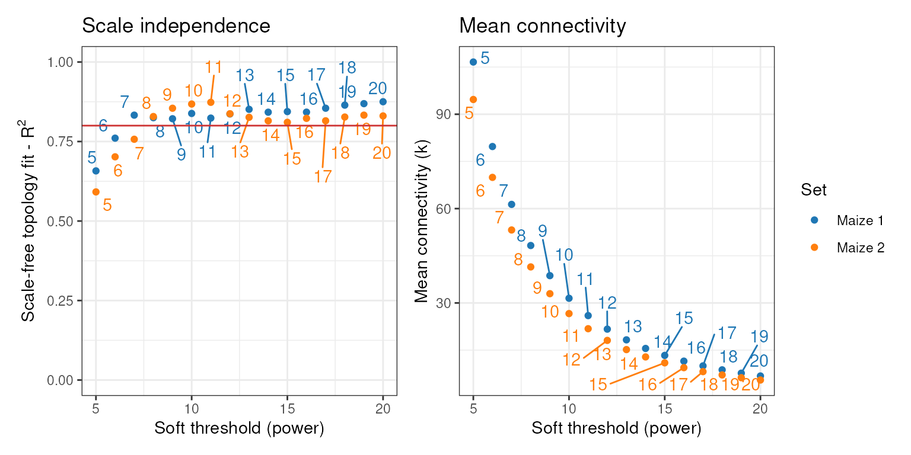
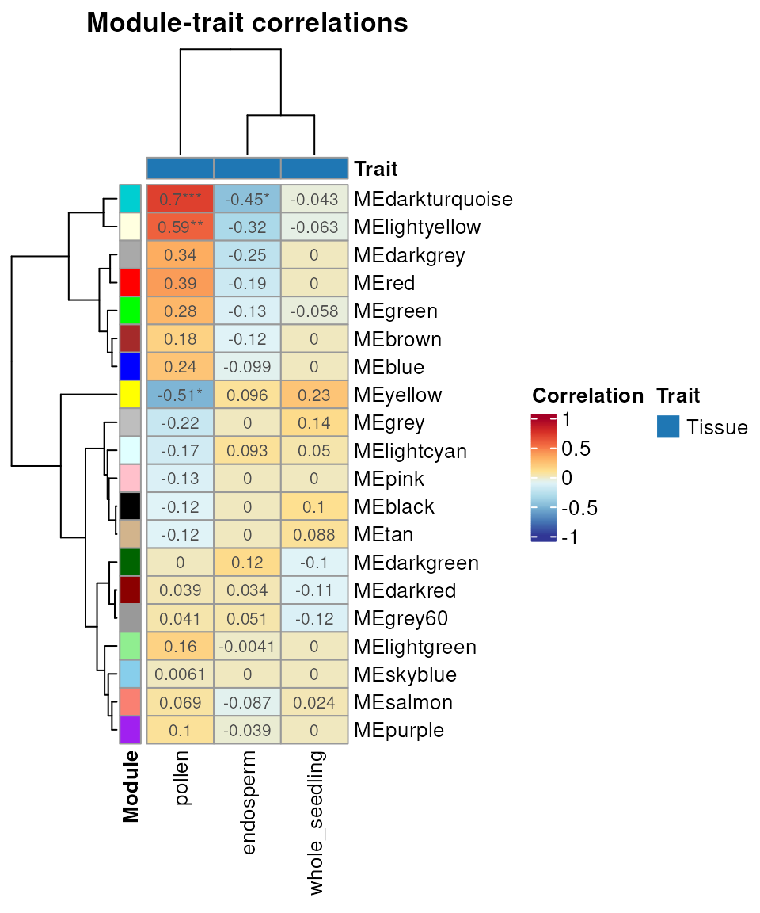

# Network comparison: consensus modules and module preservation

## Installation

`if``(``!`[`requireNamespace`](https://rdrr.io/r/base/ns-load.html)`(``'BiocManager'``, quietly ``=`` ``TRUE``)``)`` `` `[`install.packages`](https://rdrr.io/r/utils/install.packages.html)`(``'BiocManager'``)`` `` ``BiocManager``::`[`install`](https://bioconductor.github.io/BiocManager/reference/install.html)`(``"BioNERO"``)`

`# Load package after installation`` `[`library`](https://rdrr.io/r/base/library.html)`(`[`BioNERO`](https://github.com/almeidasilvaf/BioNERO)`)`` `[`set.seed`](https://rdrr.io/r/base/Random.html)`(``12``)`` ``# for reproducibility`

## Introduction

Comparing different coexpression networks can reveal relevant biological
patterns. For instance, seeking for **consensus modules** can identify
coexpression modules that occur in all data sets regardless of natural
variation and, hence, are core players of the studied phenotype.
Additionally, **module preservation** within and across species can
reveal patterns of conservation and divergence between transcriptomes.
In this vignette, we will explore consensus modules and module
preservation analyses with `BioNERO`. Although they seem similar, their
goals are opposite: while consensus modules identification focuses on
the commonalities, module preservation focuses on the divergences.

## Data loading and description

We will use RNA-seq data of maize (*Zea mays*) and rice (*Oryza sativa*)
obtained from Shin et al. (2020).

[`data`](https://rdrr.io/r/utils/data.html)`(``zma.se``)`` ``zma.se`` ``## class: SummarizedExperiment `` ``## dim: 10802 28 `` ``## metadata(0):`` ``## assays(1): ''`` ``## rownames(10802): ZeamMp030 ZeamMp044 ... Zm00001d054106 Zm00001d054107`` ``## rowData names(0):`` ``## colnames(28): SRX339756 SRX339757 ... SRX2792103 SRX2792104`` ``## colData names(1): Tissue`` `` `[`data`](https://rdrr.io/r/utils/data.html)`(``osa.se``)`` ``osa.se`` ``## class: SummarizedExperiment `` ``## dim: 7647 27 `` ``## metadata(0):`` ``## assays(1): ''`` ``## rownames(7647): Os01g0100700 Os01g0100900 ... Os12g0641400 Os12g0641500`` ``## rowData names(0):`` ``## colnames(27): SRX831140 SRX831141 ... SRX263041 SRX1544234`` ``## colData names(1): Tissue`

All `BioNERO`’s functions for consensus modules and module preservation
analyses require the expression data to be in a **list**. Each element
of the list can be a SummarizedExperiment object (recommended) or an
expression data frame with genes in row names and samples in column
names.

## Consensus modules

The most common objective in consensus modules identification is to find
core modules across different tissues or treatments for the same
species. For instance, one can infer GCNs for different types of cancer
in human tissues (say prostate and liver) and identify modules that
occur in all sets, which are likely core components of cancer biology.
Likewise, one can also identify consensus modules across samples from
different geographical origins to find modules that are not affected by
population structure or kinship.

### Data preprocessing

Here, we will subset 22 random samples from the maize data twice and
find consensus modules between the two sets.

`# Preprocess data and keep top 2000 genes with highest variances`` ``filt_zma`` ``<-`` `[`exp_preprocess`](../reference/exp_preprocess.md)`(``zma.se``, variance_filter ``=`` ``TRUE``, n ``=`` ``2000``)`` ``## Number of removed samples: 1`` `` ``# Create different subsets by resampling data`` ``zma_set1`` ``<-`` ``filt_zma``[``, `[`sample`](https://rdrr.io/r/base/sample.html)`(`[`colnames`](https://rdrr.io/r/base/colnames.html)`(``filt_zma``)``, size``=``22``, replace``=``FALSE``)``]`` ``zma_set2`` ``<-`` ``filt_zma``[``, `[`sample`](https://rdrr.io/r/base/sample.html)`(`[`colnames`](https://rdrr.io/r/base/colnames.html)`(``filt_zma``)``, size``=``22``, replace``=``FALSE``)``]`` `[`colnames`](https://rdrr.io/r/base/colnames.html)`(``zma_set1``)`` ``## [1] "SRX3804716" "SRX2792102" "SRX2527287" "SRX2792108" "SRX3804723"`` ``## [6] "SRX2792107" "SRX2792103" "SRX2792104" "SRX3804715" "SRX339808" `` ``## [11] "SRX339758" "SRX339756" "SRX339809" "SRX2792105" "SRX339757" `` ``## [16] "SRX2641029" "SRX339762" "SRX2792110" "SRX339807" "SRX3804718"`` ``## [21] "ERX2154032" "SRX339764"`` `[`colnames`](https://rdrr.io/r/base/colnames.html)`(``zma_set2``)`` ``## [1] "SRX2792111" "SRX339756" "SRX3804715" "SRX2792108" "SRX2792103"`` ``## [6] "SRX339762" "SRX339807" "ERX2154030" "SRX2792105" "SRX2792107"`` ``## [11] "SRX2527287" "ERX2154032" "SRX2792104" "SRX2527288" "SRX339809" `` ``## [16] "SRX3804718" "SRX3804716" "SRX2792109" "SRX3804723" "SRX2792102"`` ``## [21] "SRX339808" "SRX339758"`` `` ``# Create list`` ``zma_list`` ``<-`` `[`list`](https://rdrr.io/r/base/list.html)`(``set1 ``=`` ``zma_set1``, set2 ``=`` ``zma_set2``)`` `[`length`](https://rdrr.io/r/base/length.html)`(``zma_list``)`` ``## [1] 2`

### Identification of consensus modules

As described in the first vignette, before inferring the GCNs, we need
to identify the optimal $`\beta`$ power that makes the network closer to
a scale-free topology. We can do that with
[`consensus_SFT_fit()`](../reference/consensus_SFT_fit.md).

`cons_sft`` ``<-`` `[`consensus_SFT_fit`](../reference/consensus_SFT_fit.md)`(``zma_list``, setLabels ``=`` `[`c`](https://rdrr.io/r/base/c.html)`(``"Maize 1"``, ``"Maize 2"``)``,`` `` cor_method ``=`` ``"pearson"``)`` ``## Power SFT.R.sq slope truncated.R.sq mean.k. median.k. max.k.`` ``## 1 5 0.658 -0.650 0.656 107.00 90.50 304.0`` ``## 2 6 0.761 -0.706 0.774 79.70 62.90 244.0`` ``## 3 7 0.833 -0.757 0.863 61.30 45.10 200.0`` ``## 4 8 0.825 -0.830 0.868 48.30 32.80 169.0`` ``## 5 9 0.822 -0.916 0.887 38.70 24.50 145.0`` ``## 6 10 0.838 -0.975 0.910 31.50 18.90 126.0`` ``## 7 11 0.824 -1.040 0.914 26.00 15.00 111.0`` ``## 8 12 0.837 -1.090 0.932 21.70 12.20 97.6`` ``## 9 13 0.851 -1.130 0.944 18.30 10.10 86.6`` ``## 10 14 0.842 -1.190 0.941 15.50 8.42 77.3`` ``## 11 15 0.844 -1.230 0.947 13.30 7.17 69.4`` ``## 12 16 0.842 -1.270 0.951 11.50 6.13 62.5`` ``## 13 17 0.855 -1.300 0.962 9.99 5.24 56.5`` ``## 14 18 0.864 -1.320 0.967 8.73 4.54 51.3`` ``## 15 19 0.869 -1.330 0.970 7.67 3.92 46.7`` ``## 16 20 0.875 -1.340 0.977 6.78 3.38 42.7`` ``## Power SFT.R.sq slope truncated.R.sq mean.k. median.k. max.k.`` ``## 1 5 0.592 -0.621 0.574 94.70 82.40 265.0`` ``## 2 6 0.702 -0.666 0.710 69.90 56.80 209.0`` ``## 3 7 0.757 -0.713 0.771 53.20 40.30 167.0`` ``## 4 8 0.829 -0.729 0.853 41.50 29.50 136.0`` ``## 5 9 0.855 -0.782 0.884 32.90 22.10 113.0`` ``## 6 10 0.868 -0.826 0.911 26.60 17.20 96.6`` ``## 7 11 0.873 -0.868 0.931 21.80 13.70 83.2`` ``## 8 12 0.837 -0.943 0.914 18.10 11.30 73.0`` ``## 9 13 0.826 -1.000 0.917 15.20 9.30 64.7`` ``## 10 14 0.815 -1.070 0.917 12.80 7.73 57.6`` ``## 11 15 0.810 -1.120 0.926 11.00 6.53 51.5`` ``## 12 16 0.823 -1.150 0.943 9.42 5.45 46.3`` ``## 13 17 0.815 -1.210 0.942 8.16 4.57 41.8`` ``## 14 18 0.827 -1.240 0.954 7.11 3.92 37.8`` ``## 15 19 0.833 -1.260 0.964 6.23 3.42 34.3`` ``## 16 20 0.831 -1.280 0.965 5.49 2.99 31.2`

This function returns a list with the optimal powers and a summary plot,
exactly as [`SFT_fit()`](../reference/SFT_fit.md) does.

`powers`` ``<-`` ``cons_sft``$``power`` ``powers`` ``## set1 set2 `` ``## 7 8`` ``cons_sft``$``plot`

Now, we can infer GCNs and identify consensus modules across data sets.

`consensus`` ``<-`` `[`consensus_modules`](../reference/consensus_modules.md)`(``zma_list``, power ``=`` ``powers``, cor_method ``=`` ``"pearson"``)`` ``## ..connectivity..`` ``## ..matrix multiplication (system BLAS)..`` ``## ..normalization..`` ``## ..done.`` ``## ..connectivity..`` ``## ..matrix multiplication (system BLAS)..`` ``## ..normalization..`` ``## ..done.`` ``## ..done.`` ``## multiSetMEs: Calculating module MEs.`` ``## Working on set 1 ...`` ``## Working on set 2 ...`` `[`names`](https://rdrr.io/r/base/names.html)`(``consensus``)`` ``## [1] "consMEs" "exprSize" "sampleInfo" `` ``## [4] "genes_cmodules" "dendro_plot_objects"`` `[`head`](https://rdrr.io/r/utils/head.html)`(``consensus``$``genes_cmodules``)`` ``## Genes Cons_modules`` ``## 1 ZeamMp030 lightcyan`` ``## 2 ZeamMp044 grey60`` ``## 3 ZeamMp092 grey60`` ``## 4 ZeamMp108 blue`` ``## 5 ZeamMp116 grey60`` ``## 6 ZeamMp158 blue`

Finally, we can correlate consensus module eigengenes to sample metadata
(here, plant tissues).[^1]

`consensus_trait`` ``<-`` `[`consensus_trait_cor`](../reference/consensus_trait_cor.md)`(``consensus``, cor_method ``=`` ``"pearson"``)`` `[`head`](https://rdrr.io/r/utils/head.html)`(``consensus_trait``)`` ``## trait ME cor pvalue group`` ``## 1 endosperm MEblack NA NA Tissue`` ``## 2 endosperm MEgrey60 0.05143433 0.82244990 Tissue`` ``## 3 endosperm MEdarkred 0.03438255 0.88082052 Tissue`` ``## 4 endosperm MEblue -0.09885816 0.66550539 Tissue`` ``## 5 endosperm MElightcyan 0.09297754 0.68440932 Tissue`` ``## 6 endosperm MEdarkturquoise -0.45285214 0.03330611 Tissue`

As with the output of
[`module_trait_cor()`](../reference/module_trait_cor.md), users can
visualize the output of
[`consensus_trait_cor()`](../reference/consensus_trait_cor.md) with the
function
[`plot_module_trait_cor()`](../reference/plot_module_trait_cor.md).

[`plot_module_trait_cor`](../reference/plot_module_trait_cor.md)`(``consensus_trait``)`

## Module preservation

Module preservation is often used to study patterns of evolutionary
conservation and divergence across transcriptomes, an approach named
*phylotranscriptomics*. This way, one can investigate how evolution
shaped the expression profiles for particular gene families across taxa.

### Data preprocessing

To calculate module preservation statistics, gene IDs must be shared by
the expression sets. For intraspecies comparisons, this is an easy task,
as gene IDs are the same. However, for interspecies comparisons, users
need to identify orthogroups between the different species and collapse
the gene-level expression values to orthogroup-level expression values.
This way, all expression sets will have common row names. We recommend
identifying orthogroups with **OrthoFinder** (Emms and Kelly 2015), as
it is simple to use and widely used.[^2] Here, we will compare maize and
rice expression profiles. The orthogroups between these species were
downloaded from the PLAZA 4.0 Monocots database (Van Bel et al. 2018).

[`data`](https://rdrr.io/r/utils/data.html)`(``og.zma.osa``)`` `[`head`](https://rdrr.io/r/utils/head.html)`(``og.zma.osa``)`` ``## Family Species Gene`` ``## 1548 ORTHO04M000001 osa Os01g0100700`` ``## 1549 ORTHO04M000001 osa Os01g0100900`` ``## 4824 ORTHO04M000001 zma Zm00001d009743`` ``## 4854 ORTHO04M000001 zma Zm00001d020834`` ``## 4874 ORTHO04M000001 zma Zm00001d026672`` ``## 4921 ORTHO04M000001 zma Zm00001d039873`

As you can see, the orthogroup object for `BioNERO` must be a data frame
with orthogroups, species IDs and gene IDs, respectively. Let’s collapse
gene-level expression to orthogroup-level with
[`exp_genes2orthogroups()`](../reference/exp_genes2orthogroups.md). By
default, if there is more than one gene in the same orthogroup for a
given species, their expression levels are summarized to the median.
Users can also summarize to the mean.

`# Store SummarizedExperiment objects in a list`` ``zma_osa_list`` ``<-`` `[`list`](https://rdrr.io/r/base/list.html)`(``osa ``=`` ``osa.se``, zma ``=`` ``zma.se``)`` `` ``# Collapse gene-level expression to orthogroup-level`` ``ortho_exp`` ``<-`` `[`exp_genes2orthogroups`](../reference/exp_genes2orthogroups.md)`(``zma_osa_list``, ``og.zma.osa``, summarize ``=`` ``"mean"``)`` `` ``# Inspect new expression data`` ``ortho_exp``$``osa``[``1``:``5``, ``1``:``5``]`` ``## SRX831140 SRX831141 SRX831137 SRX831138 SRX831134`` ``## ORTHO04M000001 6.909420 7.258330 94.20870 92.85195 123.01060`` ``## ORTHO04M000002 9.203498 8.709974 66.45512 44.97913 33.86936`` ``## ORTHO04M000003 9.417930 9.444861 42.57513 66.02237 55.37741`` ``## ORTHO04M000004 9.019436 8.920091 96.22074 62.56506 109.32262`` ``## ORTHO04M000005 40.845040 41.844234 52.33474 31.31474 22.42236`` ``ortho_exp``$``zma``[``1``:``5``, ``1``:``5``]`` ``## SRX339756 SRX339757 SRX339758 SRX339762 SRX339763`` ``## ORTHO04M000001 26.02510 15.07917 14.91571 13.82989 8.080476`` ``## ORTHO04M000002 19.28281 13.94254 13.57854 12.96032 13.522525`` ``## ORTHO04M000003 45.17294 48.63796 54.22404 42.12135 10.779117`` ``## ORTHO04M000004 28.05475 38.53734 39.48070 27.13272 2.978207`` ``## ORTHO04M000005 67.58868 34.87009 21.46280 12.79565 7.452068`

Now, we will preprocess both expression sets and keep only the top 1000
orthogroups with the highest variances for demonstration purposes.

`# Preprocess data and keep top 1000 genes with highest variances`` ``ortho_exp`` ``<-`` `[`lapply`](https://rdrr.io/r/base/lapply.html)`(``ortho_exp``, ``exp_preprocess``, variance_filter``=``TRUE``, n``=``1000``)`` ``## Number of removed samples: 2`` ``## Number of removed samples: 2`` `` ``# Check orthogroup number`` `[`sapply`](https://rdrr.io/r/base/lapply.html)`(``ortho_exp``, ``nrow``)`` ``## osa zma `` ``## 1000 1000`

### Calculating module preservation statistics

Now that row names are comparable, we can infer GCNs for each set. We
will do that iteratively with lapply.

`# Calculate SFT power`` ``power_ortho`` ``<-`` `[`lapply`](https://rdrr.io/r/base/lapply.html)`(``ortho_exp``, ``SFT_fit``, cor_method``=``"pearson"``)`` ``## Power SFT.R.sq slope truncated.R.sq mean.k. median.k. max.k.`` ``## 1 3 0.15600 1.740 0.846 191.00 192.00 249.0`` ``## 2 4 0.12400 1.080 0.844 129.00 130.00 178.0`` ``## 3 5 0.10300 0.784 0.817 91.70 92.90 134.0`` ``## 4 6 0.06140 0.528 0.818 67.80 68.90 106.0`` ``## 5 7 0.04550 0.397 0.803 51.80 52.60 85.5`` ``## 6 8 0.02660 0.234 0.840 40.70 40.80 70.7`` ``## 7 9 0.00989 0.121 0.868 32.60 32.50 59.8`` ``## 8 10 0.04090 -0.274 0.820 26.70 26.10 53.2`` ``## 9 11 0.12200 -0.458 0.871 22.20 21.40 47.8`` ``## 10 12 0.20600 -0.600 0.908 18.80 18.00 43.4`` ``## 11 13 0.27900 -0.688 0.928 16.00 15.30 39.7`` ``## 12 14 0.39900 -0.839 0.952 13.80 13.10 36.4`` ``## 13 15 0.48600 -0.949 0.951 12.10 11.30 33.6`` ``## 14 16 0.55500 -1.010 0.959 10.60 9.71 31.2`` ``## 15 17 0.59600 -1.080 0.959 9.39 8.34 29.0`` ``## 16 18 0.64700 -1.130 0.965 8.37 7.20 27.1`` ``## 17 19 0.68300 -1.120 0.969 7.50 6.28 25.3`` ``## 18 20 0.72300 -1.120 0.979 6.76 5.52 23.8`` ``## No power reached R-squared cut-off, now choosing max R-squared based power`` ``## Power SFT.R.sq slope truncated.R.sq mean.k. median.k. max.k.`` ``## 1 3 0.6910 0.7290 0.6260 269.0 284.0 407.0`` ``## 2 4 0.4540 0.3460 0.3270 199.0 209.0 329.0`` ``## 3 5 0.0802 0.1070 -0.0486 153.0 158.0 273.0`` ``## 4 6 0.0459 -0.0746 -0.0302 121.0 123.0 233.0`` ``## 5 7 0.2620 -0.2140 0.3480 98.1 97.1 201.0`` ``## 6 8 0.4070 -0.3270 0.4820 80.7 78.1 176.0`` ``## 7 9 0.5030 -0.4180 0.5960 67.4 63.4 155.0`` ``## 8 10 0.4930 -0.4950 0.5950 57.0 52.5 138.0`` ``## 9 11 0.5730 -0.5520 0.6790 48.8 43.8 124.0`` ``## 10 12 0.5770 -0.6090 0.6860 42.1 37.2 112.0`` ``## 11 13 0.6560 -0.6500 0.7490 36.7 31.6 101.0`` ``## 12 14 0.6740 -0.7010 0.7630 32.2 27.5 92.1`` ``## 13 15 0.7240 -0.7330 0.7930 28.4 23.8 84.2`` ``## 14 16 0.7800 -0.7460 0.8470 25.3 20.6 77.3`` ``## 15 17 0.8330 -0.7540 0.9060 22.6 18.0 71.2`` ``## 16 18 0.8560 -0.7740 0.9200 20.3 15.8 65.7`` ``## 17 19 0.8690 -0.7870 0.9320 18.3 13.9 60.9`` ``## 18 20 0.8810 -0.8120 0.9240 16.6 12.3 56.6`` `` ``# Infer GCNs`` ``gcns`` ``<-`` `[`lapply`](https://rdrr.io/r/base/lapply.html)`(`[`seq_along`](https://rdrr.io/r/base/seq.html)`(``power_ortho``)``, ``function``(``n``)`` `` `` `[`exp2gcn`](../reference/exp2gcn.md)`(``ortho_exp``[[``n``]``]``, SFTpower ``=`` ``power_ortho``[[``n``]``]``$``power``, `` `` cor_method ``=`` ``"pearson"``)`` `` ``)`` ``## ..connectivity..`` ``## ..matrix multiplication (system BLAS)..`` ``## ..normalization..`` ``## ..done.`` ``## ..connectivity..`` ``## ..matrix multiplication (system BLAS)..`` ``## ..normalization..`` ``## ..done.`` `` `[`length`](https://rdrr.io/r/base/length.html)`(``gcns``)`` ``## [1] 2`

Initially, module preservation analyses were performed with WGCNA’s
algorithm (Langfelder and Horvath 2008). However, the summary
preservation statistics used by WGCNA rely on parametric assumptions
that are often not met. For this purpose, the NetRep algorithm (Ritchie
et al. 2016) is more accurate than WGCNA, as it uses non-parametric
permutation analyses. Both algorithms are implemented in `BioNERO` for
comparison purposes, but we **strongly recommend** using the NetRep
algorithm. Module preservation analysis can be performed with a single
function:
[`module_preservation()`](../reference/module_preservation.md).

`# Using rice as reference and maize as test`` ``pres`` ``<-`` `[`module_preservation`](../reference/module_preservation.md)`(``ortho_exp``, `` `` ref_net ``=`` ``gcns``[[``1``]``]``, `` `` test_net ``=`` ``gcns``[[``2``]``]``, `` `` algorithm ``=`` ``"netrep"``)`` ``## 1 modules in osa were preserved in zma:`` ``## black`

None of the modules in rice were preserved in maize. This can be either
due to the small number of orthogroups we have chosen or to the natural
biological variation between species and sampled tissues. You can (and
should) include more orthogroups in your analyses for a better view of
transcriptional conservation between species.

## Identifying singletons and duplicated genes

Finally, `BioNERO` can identify singletons and duplicated genes with
[`is_singleton()`](../reference/is_singleton.md). This function returns
logical vectors indicating if each of the input genes is a singleton or
not.

`# Sample 50 random genes`` ``genes`` ``<-`` `[`sample`](https://rdrr.io/r/base/sample.html)`(`[`rownames`](https://rdrr.io/r/base/colnames.html)`(``zma.se``)``, size ``=`` ``50``)`` `[`is_singleton`](../reference/is_singleton.md)`(``genes``, ``og.zma.osa``)`` ``## Zm00001d001841 Zm00001d002104 Zm00001d004006 Zm00001d005944 Zm00001d006390 `` ``## TRUE TRUE TRUE TRUE TRUE `` ``## Zm00001d008725 Zm00001d008874 Zm00001d009669 Zm00001d011096 Zm00001d011507 `` ``## TRUE TRUE TRUE TRUE TRUE `` ``## Zm00001d012816 Zm00001d014124 Zm00001d014890 Zm00001d015497 Zm00001d017085 `` ``## TRUE TRUE TRUE TRUE TRUE `` ``## Zm00001d017275 Zm00001d017654 Zm00001d019718 Zm00001d020807 Zm00001d025222 `` ``## TRUE TRUE TRUE TRUE TRUE `` ``## Zm00001d028731 Zm00001d030626 Zm00001d031041 Zm00001d031963 Zm00001d032111 `` ``## TRUE TRUE TRUE TRUE TRUE `` ``## Zm00001d032186 Zm00001d032231 Zm00001d032671 Zm00001d032843 Zm00001d034004 `` ``## TRUE TRUE TRUE TRUE TRUE `` ``## Zm00001d034713 Zm00001d036482 Zm00001d036651 Zm00001d037613 Zm00001d038937 `` ``## TRUE TRUE TRUE TRUE TRUE `` ``## Zm00001d038960 Zm00001d039619 Zm00001d042213 Zm00001d043146 Zm00001d043914 `` ``## TRUE TRUE TRUE TRUE TRUE `` ``## Zm00001d044251 Zm00001d044274 Zm00001d047303 Zm00001d048893 Zm00001d049399 `` ``## TRUE TRUE TRUE TRUE TRUE `` ``## Zm00001d049617 Zm00001d052078 Zm00001d052888 Zm00001d053016 Zm00001d053962 `` ``## TRUE TRUE TRUE TRUE TRUE`

## Session info

This vignette was created under the following conditions:

    ## R version 4.6.1 (2026-06-24)
    ## Platform: x86_64-pc-linux-gnu
    ## Running under: Ubuntu 24.04.4 LTS
    ## 
    ## Matrix products: default
    ## BLAS:   /usr/lib/x86_64-linux-gnu/openblas-pthread/libblas.so.3 
    ## LAPACK: /usr/lib/x86_64-linux-gnu/openblas-pthread/libopenblasp-r0.3.26.so;  LAPACK version 3.12.0
    ## 
    ## locale:
    ##  [1] LC_CTYPE=en_US.UTF-8       LC_NUMERIC=C              
    ##  [3] LC_TIME=en_US.UTF-8        LC_COLLATE=en_US.UTF-8    
    ##  [5] LC_MONETARY=en_US.UTF-8    LC_MESSAGES=en_US.UTF-8   
    ##  [7] LC_PAPER=en_US.UTF-8       LC_NAME=C                 
    ##  [9] LC_ADDRESS=C               LC_TELEPHONE=C            
    ## [11] LC_MEASUREMENT=en_US.UTF-8 LC_IDENTIFICATION=C       
    ## 
    ## time zone: UTC
    ## tzcode source: system (glibc)
    ## 
    ## attached base packages:
    ## [1] stats     graphics  grDevices utils     datasets  methods   base     
    ## 
    ## other attached packages:
    ## [1] BioNERO_1.21.0   BiocStyle_2.41.0
    ## 
    ## loaded via a namespace (and not attached):
    ##   [1] RColorBrewer_1.1-3          ggdendro_0.2.0             
    ##   [3] rstudioapi_0.19.0           jsonlite_2.0.0             
    ##   [5] shape_1.4.6.1               NetRep_1.2.10              
    ##   [7] magrittr_2.0.5              farver_2.1.2               
    ##   [9] rmarkdown_2.32              GlobalOptions_0.1.4        
    ##  [11] fs_2.1.0                    ragg_1.5.2                 
    ##  [13] vctrs_0.7.3                 memoise_2.0.1              
    ##  [15] base64enc_0.1-6             BiocBaseUtils_1.15.1       
    ##  [17] htmltools_0.5.9             S4Arrays_1.13.0            
    ##  [19] dynamicTreeCut_1.63-1       SparseArray_1.13.2         
    ##  [21] Formula_1.2-6               sass_0.4.10                
    ##  [23] bslib_0.12.0                htmlwidgets_1.6.4          
    ##  [25] desc_1.4.3                  plyr_1.8.9                 
    ##  [27] impute_1.87.0               cachem_1.1.0               
    ##  [29] igraph_2.3.3                lifecycle_1.0.5            
    ##  [31] ggnetwork_0.5.14            iterators_1.0.14           
    ##  [33] pkgconfig_2.0.3             Matrix_1.7-6               
    ##  [35] R6_2.6.1                    fastmap_1.2.0              
    ##  [37] MatrixGenerics_1.25.0       clue_0.3-68                
    ##  [39] digest_0.6.39               colorspace_2.1-3           
    ##  [41] patchwork_1.3.2             AnnotationDbi_1.75.2       
    ##  [43] S4Vectors_0.51.9            GENIE3_1.35.0              
    ##  [45] textshaping_1.0.5           Hmisc_5.3-0                
    ##  [47] GenomicRanges_1.65.4        RSQLite_3.53.3             
    ##  [49] labeling_0.4.3              mgcv_1.9-4                 
    ##  [51] httr_1.4.9                  abind_1.4-8                
    ##  [53] compiler_4.6.1              withr_3.0.3                
    ##  [55] bit64_4.8.6                 doParallel_1.0.17          
    ##  [57] htmlTable_2.5.0             S7_0.2.2                   
    ##  [59] backports_1.5.1             BiocParallel_1.47.0        
    ##  [61] DBI_1.3.0                   intergraph_2.0-4           
    ##  [63] MASS_7.3-66                 DelayedArray_0.39.6        
    ##  [65] rjson_0.2.23                tools_4.6.1                
    ##  [67] foreign_0.8-91              otel_0.2.0                 
    ##  [69] nnet_7.3-21                 glue_1.8.1                 
    ##  [71] nlme_3.1-171                grid_4.6.1                 
    ##  [73] checkmate_2.3.4             cluster_2.1.8.3            
    ##  [75] reshape2_1.4.5              generics_0.1.4             
    ##  [77] sva_3.59.0                  gtable_0.3.6               
    ##  [79] preprocessCore_1.75.1       sna_2.8                    
    ##  [81] data.table_1.18.6.1         WGCNA_1.74                 
    ##  [83] XVector_0.53.0              BiocGenerics_0.59.12       
    ##  [85] ggrepel_0.9.8               foreach_1.5.2              
    ##  [87] pillar_1.11.1               stringr_1.6.0              
    ##  [89] limma_3.99.0                genefilter_1.95.0          
    ##  [91] circlize_0.4.18             splines_4.6.1              
    ##  [93] dplyr_1.2.1                 lattice_0.23-1             
    ##  [95] survival_3.8-11             bit_4.6.0                  
    ##  [97] annotate_1.91.0             tidyselect_1.2.1           
    ##  [99] locfit_1.5-9.12             ComplexHeatmap_2.29.0      
    ## [101] Biostrings_2.81.9           knitr_1.52                 
    ## [103] gridExtra_2.3.1             bookdown_0.48              
    ## [105] IRanges_2.47.5              Seqinfo_1.3.2              
    ## [107] edgeR_4.99.4                SummarizedExperiment_1.43.0
    ## [109] RhpcBLASctl_0.23-42         stats4_4.6.1               
    ## [111] xfun_0.60                   Biobase_2.73.2             
    ## [113] statmod_1.5.2               matrixStats_1.5.0          
    ## [115] stringi_1.8.9               statnet.common_4.13.0      
    ## [117] yaml_2.3.12                 minet_3.71.0               
    ## [119] evaluate_1.0.5              codetools_0.2-20           
    ## [121] tibble_3.3.1                BiocManager_1.30.27        
    ## [123] cli_3.6.6                   rpart_4.1.27               
    ## [125] xtable_1.8-8                systemfonts_1.3.2          
    ## [127] jquerylib_0.1.4             network_1.20.0             
    ## [129] Rcpp_1.1.2                  coda_0.19-4.1              
    ## [131] png_0.1-9                   fastcluster_1.3.0          
    ## [133] XML_3.99-0.24               parallel_4.6.1             
    ## [135] pkgdown_2.2.1               ggplot2_4.0.3              
    ## [137] blob_1.3.0                  scales_1.4.0               
    ## [139] crayon_1.5.3                GetoptLong_1.1.1           
    ## [141] rlang_1.3.0                 KEGGREST_1.53.6

## References

Emms, David M., and Steven Kelly. 2015. “OrthoFinder: solving
fundamental biases in whole genome comparisons dramatically improves
orthogroup inference accuracy.” *Genome Biology* 16 (1): 1–14.
<https://doi.org/10.1186/s13059-015-0721-2>.

Langfelder, Peter, and Steve Horvath. 2008. “WGCNA: an R package for
weighted correlation network analysis.” *BMC Bioinformatics* 9 (1): 559.
<https://doi.org/10.1186/1471-2105-9-559>.

Ritchie, Scott C., Stephen Watts, Liam G. Fearnley, Kathryn E. Holt, Gad
Abraham, and Michael Inouye. 2016. “A Scalable Permutation Approach
Reveals Replication and Preservation Patterns of Network Modules in
Large Datasets.” *Cell Systems* 3 (1): 71–82.
<https://doi.org/10.1016/j.cels.2016.06.012>.

Shin, Junha, Harald Marx, Alicia Richards, et al. 2020. “A network-based
comparative framework to study conservation and divergence of proteomes
in plant phylogenies.” *Nucleic Acids Research*, 1–23.
<https://doi.org/10.1093/nar/gkaa1041>.

Van Bel, Michiel, Tim Diels, Emmelien Vancaester, et al. 2018. “PLAZA
4.0: An integrative resource for functional, evolutionary and
comparative plant genomics.” *Nucleic Acids Research* 46 (D1): D1190–96.
<https://doi.org/10.1093/nar/gkx1002>.

[^1]: **NOTE:** Blank grey cells in the heatmap represent correlation
    values that have opposite sign in the expression sets. For each
    correlation pair, consensus correlations are calculated by selecting
    the minimum value across matrices of consensus module-trait
    correlations.

[^2]: **PRO TIP:** If you identify orthogroups with **OrthoFinder**,
    `BioNERO` has a helper function named
    [`parse_orthofinder()`](../reference/parse_orthofinder.md) that
    parses the *Orthogroups.tsv* file generated by OrthoFinder into a
    suitable data frame for module preservation analysis. See
    [`?parse_orthofinder`](../reference/parse_orthofinder.md) for more
    details.
